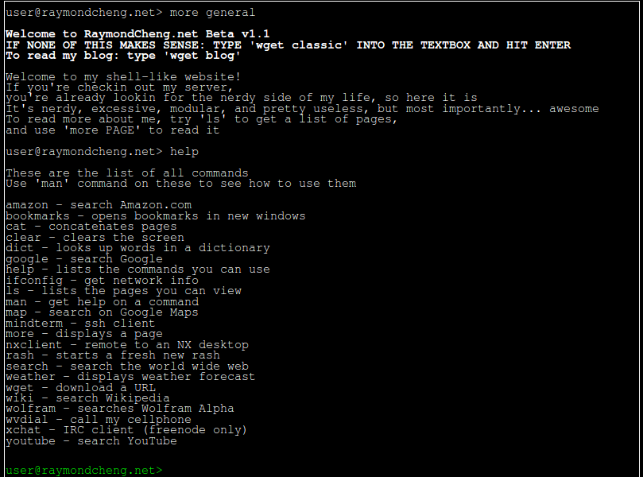
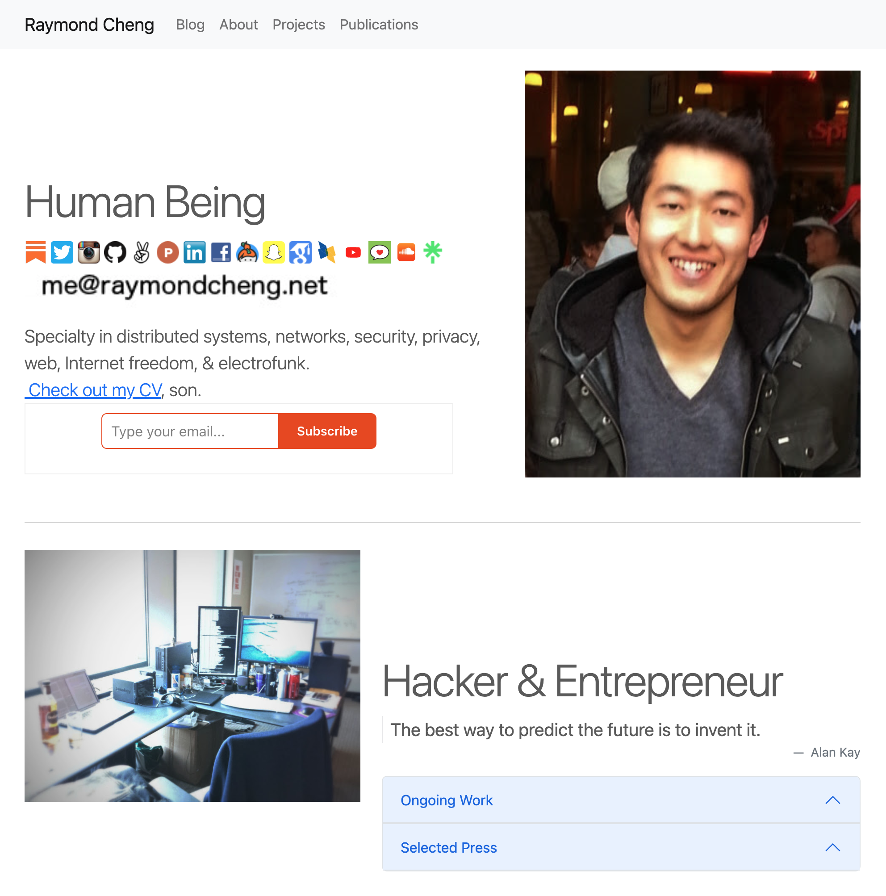

# www.raymondcheng.net

This website has gone through multiple complete rewrites over the past 15+ years.
I've tried my best to keep up with the latest technology trends;
yet I wonder how many more times I'm going to have to rewrite this thing in my career.

## PHP Terminal Emulation (circa 2008)

- `./php-terminal/`

At this time in my life, I was writing a lot of PHP for my personal projects,
as the [LAMP stack](https://en.wikipedia.org/wiki/LAMP_(software_bundle)) 
was the predominant way people wrote web applications.

[AJAX](https://en.wikipedia.org/wiki/Ajax_(programming)) was growing as a movement,
as Gmail was launched in 2004, but I had a severe distrust in running
any client-side JavaScript at the time.
It was both a pain (the tooling was still primitive), and I didn't like the idea of
my static websites running client-side logic, which could be prone to vulnerabilities.
[jQuery](https://en.wikipedia.org/wiki/JQuery) came out in 2006
and people were just directly hacking on the DOM for the most part,
often filled with cross-site scripting bugs.

I was (and continue to be) an avid fan of the UNIX terminal interface,
so I wanted my website to reflect my personality,
while being nearly impossible for anyone to actually use.
I wrote this little beauty in 100% server-side PHP.
It allowed you to `ls` and `cat` your way through my biography.
It also allowed for shortcut commands (i.e. map, weather, search) to redirect you 
to the relevant webpages before the days of Mozilla Ubiquity
or the Google knowledge graph.

When I got to grad school and people were trying to find my publications,
I realized I needed to replace this with something more readable.

## Static HTML with Bootstrap (circa 2013)

- `./static/`

[Bootstrap](https://en.wikipedia.org/wiki/Bootstrap_%28front-end_framework%29)
had just come out in 2011, which finally made it trivial to build a beautiful website.
Prior to that, it was a lot of manually hacking on CSS, which was just dreadful.
I hand-wrote static HTML pages, leveraging Bootstrap to magically make it look pretty.

This is when I started enumerating the different aspects of my life,
from my work, to my travel, to my eclectic hobbies.

## Jekyll Static Site Generator (circa 2015)

- `./jekyll/`

I first found out about [Jekyll](https://en.wikipedia.org/wiki/Jekyll_%28software%29)
when I realized that GitHub pages both offered free static site hosting with custom domains
and had built-in support for building Jekyll sites on push.
These were the really early days of CI/CD, when we were still
getting used to the patterns of continuous delivery.
[Travis CI](https://en.wikipedia.org/wiki/Travis_CI) was launched in 2011
and [Docker](https://en.wikipedia.org/wiki/Docker_(software)) was launched in 2013.
All these free services finally made it accessible for someone like me
to play with static site generation in continuous delivery.

## Docusaurus (circa 2023)

It's 2023. Why am I still using Ruby-based anything (Jekyll)?
React is the clear winner for front-ends, it's time to move to a React-based framework.
Docusaurus seems to do a really good job with good defaults.
