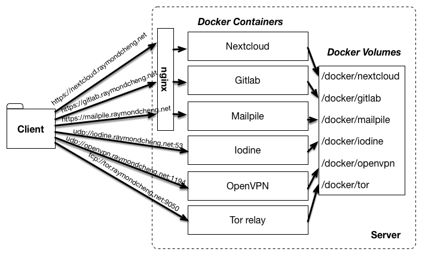

In this blog post, I'll show you how to configure a Docker-based personal server, running each service in a separate Docker container. Modern devops tools have made it easier than ever to run your own server and for anyone with basic familiarity with Linux, it's worth a try. In this tutorial, we'll use [Gitlab](https://about.gitlab.com/) as a running example.

<!--truncate-->

#### Goals
- **Replicable**: If you want to move to a new server, you should be up and running with little effort.
- **Simple backups**: It should be as easy as a single `rsync` to back up all important state.
- **Secure**: All connections to your server should be over secure channels (e.g. TLS or SSH).
- **Low maintenance**: Aside from making sure the machine stays on and periodic software updates, there should be little to no maintenance.

---

## Table of Contents
- [Why Run Your Own Server?](#why-run-your-own-server)
- [Overview](#overview) 
- [Prerequisites](#step-1-prerequisites)
- [Domain Name](#step-2-domain-name)
- [Docker Compose](#step-3-docker-compose)
- [Nginx and SSL Certificates](#step-4-nginx-and-ssl-certificates)
- [Firewall](#step-5-firewall)
- [Gitlab-specific Configuration](#step-6-gitlab-specific-configuration)
- [Data Backup](#data-backup)
- [Updating Docker Images](#updating-docker-images)
- [More Services](#more-services)

---

## Why Run Your Own Server?

**Cost**: Most web apps will charge you an arm and a leg if you go past the free tier of their service. When you want to manage terabytes of data on a Dropbox-like interface across all your devices, Nextcloud is the best way to go.

**Visibility**: By running free and open source software on your own hardware, you can read the code, monitor its behavior, and see what is going on inside and out the application.

**Customizable**: You can run whatever you want on your server. Leverage this freedom to automate common tasks, integrate with other applications, and extend application functionality.

**Control**: Keep your data on your own hardware and directly control who has access to see it.

Docker images are now available for a wide-variety of server applications. 
Check out [More Services](#more-services) for setting up specific applications.

---

## Overview


[Docker](https://www.docker.com/what-docker) makes it trivially easy to package an application with all of its dependencies in a standardized unit that runs in an isolated Linux container. For basic tutorials on how to use it, Docker maintains excellent documentation [here](https://docs.docker.com/).

Our strategy is threefold:

**Docker Compose to declare services**
[Docker Compose](https://docs.docker.com/compose/) allows you to declaratively specify a set of services that you want to run on your Docker engine. Then, starting all of your services is as easy as `docker-compose up`, which will also download application images from [Docker Hub](https://hub.docker.com/).

**Store persistent state in Docker volumes**
[Docker volumes](https://docs.docker.com/engine/userguide/dockervolumes/) allow you to mount a local directory into the Docker container. For example, you may want to store the data from a MySQL database (*/var/lib/mysql*) locally. Docker volumes can then easily be backed up and restored on a new machine.

**Routing with wildcard DNS and TLS**
In order to make our Docker-ized services securely accessible from subdomains (e.g. https://gitlab.example.com), we'll set up wildcard DNS entries to point to the server and configure an Nginx reverse proxy to route requests to the proper container.

---

## Step 1: Prerequisites
This guide will assume you know how to setup a Linux machine with a public IP address. You can rent a virtual machine from any cloud provider, use a desktop at home, or buy a dedicated device like the Raspberry Pi.

The only prerequisites that need to be installed are:
- [Nginx](https://www.nginx.com/resources/wiki/start/topics/tutorials/install/)
- [Docker Engine](https://docs.docker.com/engine/installation/)
- [Docker Compose](https://docs.docker.com/compose/install/)

On Ubuntu, you may type the following commands. If the versions are not high enough, follow the installation guides above

```bash
$ sudo apt-get install nginx docker.io docker-compose
```

---

## Step 2: Domain Name

You'll need a domain name that points to your server. In this example, I'll set `*.raymondcheng.net` to point to the same machine. 


Verify that DNS queries are properly returning the address

```bash
$ dig gitlab.raymondcheng.net
; <<>> DiG 9.8 <<>> gitlab.raymondcheng.net
;; global options: +cmd
;; Got answer:
;; ->>HEADER<<- opcode: QUERY, status: NOERROR, id: 14132
;; flags: qr rd ra; QUERY: 1, ANSWER: 1, AUTHORITY: 0, ADDITIONAL: 0

;; QUESTION SECTION:
;gitlab.raymondcheng.net IN A

;; ANSWER SECTION:
gitlab.raymondcheng.net 3600 IN A 10.11.12.13

;; Query time: 60 msec
;; SERVER: 8.8.8.8#53(8.8.8.8)
;; WHEN: Fri Nov 18 17:02:20 2016
;; MSG SIZE  rcvd: 91
```

---

## Step 3: Docker Compose

First create a `docker-compose.yml` file, where we will configure all of the services we want to run. For example to run a Gitlab service, use the following:

```yml
version: "2"
services:
  gitlab:
    image: gitlab/gitlab-ce
    hostname: gitlab.raymondcheng.net
    ports:
      - 8765:80
      - 2345:22
    volumes:
      - ~/docker/gitlab/config:/etc/gitlab
      - ~/docker/gitlab/logs:/var/log/gitlab
      - ~/docker/gitlab/data:/var/opt/gitlab
```

Additional services can be added to the bottom of the file, making sure to indent properly under `services:`. Let's go over what each line is doing:

```yml
version: "2"
services:
```
Initialize the file, using version 2 syntax. All services are listed under `services:`.

```yml
  gitlab:
    image: gitlab/gitlab-ce
    hostname: gitlab.raymondcheng.net
```
Create a service named `gitlab`, using the Docker image `gitlab/gitlab-ce`. The Gitlab image requires `hostname` be set for configuration.

```yml
    ports:
      - 8765:80
      - 2345:22
    volumes:
      - ~/docker/gitlab/config:/etc/gitlab
      - ~/docker/gitlab/logs:/var/log/gitlab
      - ~/docker/gitlab/data:/var/opt/gitlab
```
These are parameters you'll need to set for every service you enable. Ports define port forwarding rules from your host computer to the container. Gitlab by default has internal ports 80 and 22 for the web service and SSH, respectively. These rules expose the ports to 8765 and 2345 on the host computer respectively. As such, you should be able to access the service at `http://localhost:8765`. Eventually, we will block access to 8765 in [Step 5: Firewall](#step-5-firewall). Similarly, the Gitlab SSH service is accessible at ssh://localhost:2345.

We also configure Docker volumes to store all Gitlab related state to a folder on the host computer. In the example, the **configurations** can be found in `~/docker/gitlab/config`, the **logs** in `~/docker/gitlab/logs`, and the **data** in `~/docker/gitlab/data`. These folders are mapped into the container at the specified paths.

Finally, start the services:
 
```bash
$ docker-compose -f docker-compose.yml up
```
In order to access this over an SSH connection, it may be helpful to run `docker-compose` in a [tmux](http://blog.hawkhost.com/2010/06/28/tmux-the-terminal-multiplexer/) session.

The services can be stopped with the corresponding command:

```bash
$ docker-compose down
```

---

## Step 4: Nginx and SSL Certificates
We use Nginx as a reverse HTTP proxy, terminating SSL connections and routing HTTP requests to the proper container. 
*Note: We run Nginx locally on the host computer, instead of in a Docker container as common in [other guides](https://www.outcoldman.com/en/archive/2015/03/18/docker-for-home-server/). It works either way, I just find this easier to debug when things go wrong.*

First, you'll need to get an SSL certificate for your wildcard domain (e.g. *.raymondcheng.net). You can get these fairly cheap from a commercial certificate authority. I recommend using Namecheap, as best described in this guide:
[How To Install an SSL Certificate from a Commercial Certificate Authority](https://www.digitalocean.com/community/tutorials/how-to-install-an-ssl-certificate-from-a-commercial-certificate-authority)

You can also use a free certificate authority, like Let's Encrypt. Here are 2 guides that I recommmend:
- [Install, configure and automatically renew Let's Encrypt SSL certificate](https://vincent.composieux.fr/article/install-configure-and-automatically-renew-let-s-encrypt-ssl-certificate)
- [Let's Encrypt & Nginx](https://www.nginx.com/blog/using-free-ssltls-certificates-from-lets-encrypt-with-nginx/)

Once you've completed one of these guides, you should have 2 files:
1. an SSL Certificate (e.g. `server.crt`)
2. a private key (e.g. `server.key`) - *Keep this safe!*

Now we'll configure Nginx to use these certificates. You'll need to generate an Nginx configuration **for each** Docker service that you are running. I recommend that you use the [Mozilla SSL Configuration Generator](https://mozilla.github.io/server-side-tls/ssl-config-generator/) to generate yours.

```javascript
server {
  listen 80 default_server;
  listen [::]:80 default_server;

  # Redirect all HTTP requests to HTTPS with a 301 Moved Permanently response.
  return 301 https://$host$request_uri;
}

server {
  server_name gitlab.raymondcheng.net
  listen 443 ssl http2;
  listen [::]:443 ssl http2;

  # certs sent to the client in SERVER HELLO are concatenated in ssl_certificate
  # certs should be signed and include intermediates;
  ssl_certificate /path/to/server.crt
  ssl_certificate_key /path/to/server.key;
  ssl_session_timeout 1d;
  ssl_session_cache shared:SSL:50m;
  ssl_session_tickets off;

  # modern configuration. tweak to your needs.
  ssl_protocols TLSv1.2;
  ssl_ciphers 'ECDHE-ECDSA-AES256-GCM-SHA384:ECDHE-RSA-AES256-GCM-SHA384:ECDHE-ECDSA-CHACHA20-POLY1305:ECDHE-RSA-CHACHA20-POLY1305:ECDHE-ECDSA-AES128-GCM-SHA256:ECDHE-RSA-AES128-GCM-SHA256:ECDHE-ECDSA-AES256-SHA384:ECDHE-RSA-AES256-SHA384:ECDHE-ECDSA-AES128-SHA256:ECDHE-RSA-AES128-SHA256';
  ssl_prefer_server_ciphers on;

  # HSTS (ngx_http_headers_module is required) (15768000 seconds = 6 months)
  add_header Strict-Transport-Security max-age=15768000;

  # OCSP Stapling ---
  # fetch OCSP records from URL in ssl_certificate and cache them
  ssl_stapling on;
  ssl_stapling_verify on;

  # Proxy
  add_header X-Frame-Options DENY;
  add_header X-Content-Type-Options nosniff;
  client_max_body_size 10G;
  location / {
    proxy_pass http://localhost:8765;
  }
}
```

Most of these settings are good as is. I'll explain the few changes that need to be made manually:

```javascript
server {
  server_name gitlab.raymondcheng.net
  ...
```
Configure Nginx to use this configuration only for requests to gitlab.raymondcheng.net

```javascript
  ssl_certificate /path/to/server.crt
  ssl_certificate_key /path/to/server.key;
```
Point these to the SSL certificate and key generated earlier.

```javascript
  # Proxy
  add_header X-Frame-Options DENY;
  add_header X-Content-Type-Options nosniff;
  client_max_body_size 10G;
  location / {
    proxy_pass http://localhost:8765;
  }
```
Prevent our pages from being included in an iframe, prevent MIME-type sniffing, allow forwarding of data payloads up to 10GB, and forward all requests to our Docker container at `http://localhost:8765`.

Last but not least, configure Nginx to use this file and restart Nginx. In Ubuntu, this is as easy as copying the file to `/etc/nginx/sites-enabled` and restarting the service

```bash
$ sudo cp gitlab.conf /etc/nginx/sites-enabled/
$ sudo service nginx restart
```

Verify that the service started properly: by running `sudo service nginx status`.

---

## Step 5: Firewall

If the service only exposes a web interface, you usually want to block access to the HTTP port, and only access through SSL connections to Nginx. In our Gitlab example, I'd block access to port 8765 (the exposed port from our Docker container) and allow access to Nginx on port 443. On Ubuntu, this is configured using `ufw`.

```bash
$ sudo ufw enable         # Blocks all ports by default 
$ sudo ufw allow 443/tcp
```

Remember that Gitlab also has an SSH interface, which we exposed on port 2345. We'll need to open access to that too

```bash
$ sudo ufw allow 2345/tcp
```

---

## Step 6: Gitlab-specific Configuration

#### Setup

Once the Gitlab service is running, you can access it through your service-specific domain (e.g. `https://gitlab.raymondcheng.net`). Gitlab will walk you through the initial configuration. There, you'll create users, groups, and repositories.

Gitlab's configuration file is found at `~/docker/gitlab/config/gitlab.rb`.

The official Gitlab docker guide can be found [here](https://docs.gitlab.com/omnibus/docker/).

#### Gitlab backups

For some reason just for Gitlab, recovery hasn't been as easy as copying all of the Docker volumes to a new machine. So just in case, I also do Gitlab-specific backups.

```bash
$ docker exec -i -t scripts_gitlab_1 gitlab-rake gitlab:backup:create
```
In this example, `scripts_gitlab_1` is the ID of the Docker container running Gitlab at the moment. You can find the ID of any running container by running `docker ps`. Backup files will be generated and stored in `~/docker/gitlab/data/backups/`. Since it's part of the Docker volume, it'll be backed up with the rest of the files, just in case you need it.

#### Accessing Gitlab

Because we configure Gitlab SSH to be on a non-standard port, it is easiest to add it to your `~/.ssh/config`.

```yml
Host gitlab
Hostname gitlab.raymondcheng.net
  User git
  Port 2345
```

In this case, you can now just clone repositories using the shorthand:

```bash
$ git clone gitlab:user/repo.git
```

---

## Data Backup
Because all important files from the Docker containers are stored a local directory, you can easily back up this folder using any backup tool, such as `rsync`. For example, if you stored all your Docker volumes in `/docker`:

```bash
$ rsync --delete -avz -e ssh /docker [USER@]HOST:DEST
```

Also be sure to keep backups of your SSL certificates and Nginx configurations. You'll need those

If you ever replace your machine or hard drive, simply copy this directory back to your new hard drive, relaunch your `docker-compose` configuration, and re-setup Nginx/firewall.


---

## Updating Docker Images
In order to update a single application, stop `docker-compose` and pull the latest image from Docker Hub:

```bash
$ docker-compose down
$ docker pull NAME[:TAG]
```

If you want to delete all containers and images from your system, run the following. The next time you run `docker-compose up`, it will pull the latest from Docker Hub.

```bash
# Delete all containers
$ docker rm $(docker ps -a -q)
# Delete all images
$ docker rmi $(docker images -q)
# Delete all dangling images
$ docker rmi $(docker images -q -f dangling=true)
```

---

## More Services
Check out the following application-specific guides for setting up 

- [Nextcloud](https://hub.docker.com/_/nextcloud/) instead of Dropbox/Google Drive/OneDrive
  - also supports syncing calendars, contacts, and tasks
- [Gitlab](https://hub.docker.com/r/gitlab/gitlab-ce/) instead of GitHub/Bitbucket
- [OpenVPN](https://hub.docker.com/r/kylemanna/openvpn/) is a VPN server over SSL/TLS
- [Libreswan](https://github.com/hwdsl2/docker-ipsec-vpn-server/blob/master/README.md) is a VPN server over IPSec
- [Iodine](https://hub.docker.com/r/ryscheng/docker-iodine/) helps you tunnel out of restricted networks.
- [Mailpile](https://www.mailpile.is/) is a searchable e-mail client.
- [Mattermost](https://hub.docker.com/r/mattermost/platform/) is a chat server with functionality similar to Slack.
- [ShareLaTeX](https://hub.docker.com/r/sharelatex/sharelatex/) for collaborative real-time LaTeX editing
- [Piwik](https://hub.docker.com/_/piwik/) instead of Google Analytics
- [Home Assistant](https://hub.docker.com/r/homeassistant/home-assistant/) for home automation

---

## Final Thoughts
In the 90's and early 2000's, I maintained a very opinionated server setup. But for anyone that has ever tried to maintain an email or chat server, you'll know just how much of a pain of an ass it was back then. I'm really excited to see open source projects like Gitlab, Nextcloud, and Signal mature into usable products that compete with their centralized proprietary counterparts. For at least the data that is most prized to me (files, contacts, calendar, code, and messages), I've been using free and open source software on my own hardware and I haven't looked back since.

Here are some other guides that cover similar topics:
- [Using docker at home](https://outcoldman.com/en/archive/2015/03/18/docker-for-home-server/)
- [Docker with Owncloud](http://www.linux-magazine.com/Issues/2014/168/Docker-with-OwnCloud/)

Feel free to email me with feedback if any of this gets outdated.
