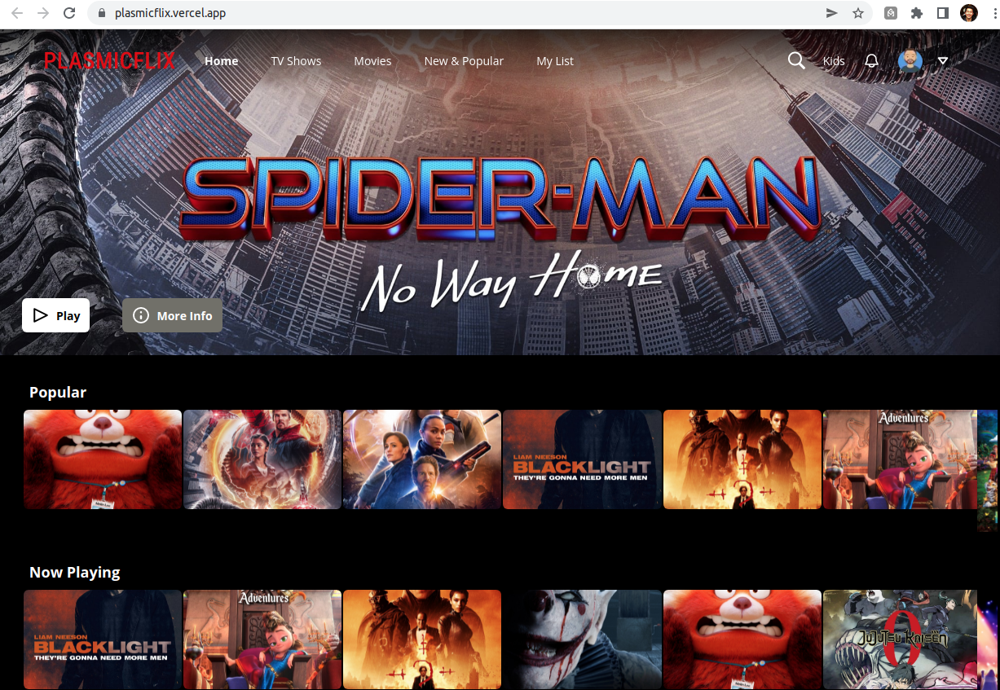
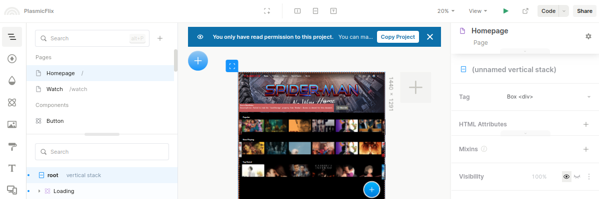
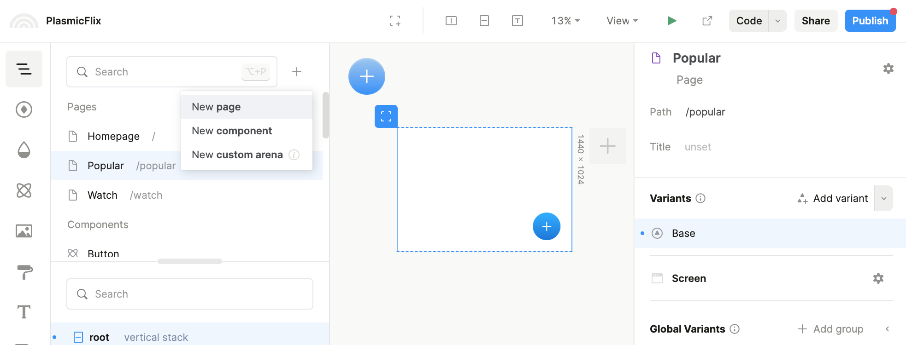
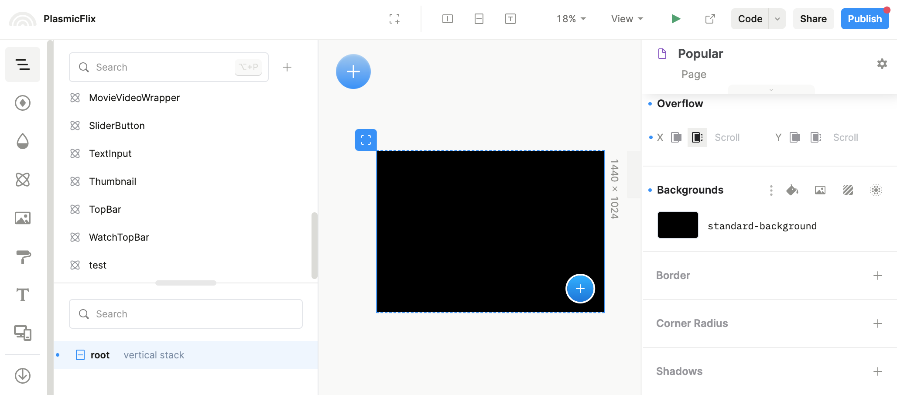
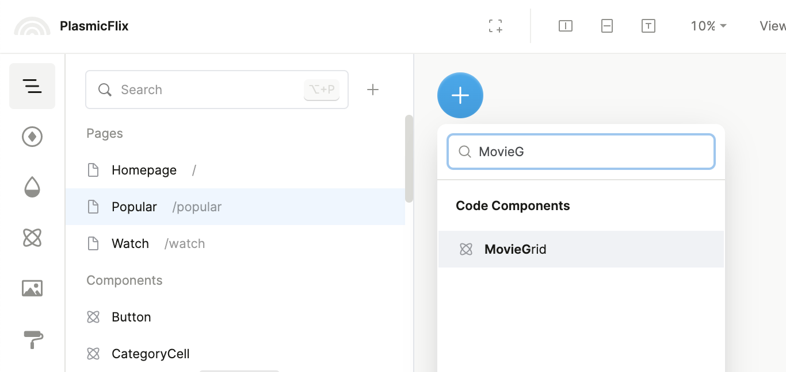
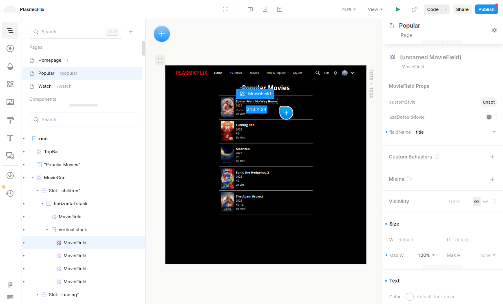

import Head from '@docusaurus/Head';
import ReactPlayer from "react-player";

<Head>
    <link rel="canonical" href="https://www.plasmic.app/blog/building-netflix-clone" />
</Head>

In this guide, we will show you how to build a video player web application with [Plasmic](https://www.plasmic.app/), a visual builder for React. While many Plasmic users use it to build landing and content pages, Plasmic is actually a powerful UI builder for apps of any complexity, allowing you or your design team to rapidly iterate on rich web applications.

<!--truncate-->

[Plasmic](https://www.plasmic.app/) is a new type of low-code tool that can drag and drop React components from your codebase, and render back into your codebase, which you own. This deep integration with code is powerful, letting you introduce arbitrary functionality—but most importantly, it ensures you are always in control. The app builder is never a walled garden that limits what you can do.

You can play with the live demo here:  
[https://plasmicflix.vercel.app/](https://plasmicflix.vercel.app/)

For an inside look at the Plasmic project,
[see here](https://studio.plasmic.app/projects/eqfalst4t10N8!
NQBEf6ytvNJgLEmjN2).



## Overview

- Plasmic is used to create the pages and visual design of the application.
- Plasmic can drag and drop React components from our Next.js codebase. In this app, we have components that query and display data from [The Movie Database](https://www.themoviedb.org/).
- Plasmic designed pages are rendered back into the Next.js application.

## Step 1: Clone the Plasmic project

Let’s first explore what it’s like to use Plasmic Studio to edit the app visually.

Open the Plasmic project  
[here](https://studio.plasmic.app/projects/eqrDNQBEf6ytvNJgLEmjN2).



Make a copy of it that you can edit by clicking the `Copy Project` button in the blue bar. This will clone the project and take you to your project.

## Step 2: Create a popular movie list

Let’s make a new page for top movie rankings by using the code components from the code base.

Create a new page called `Popular Movies`, and set a path for this page (`/popular`).



Set the background of the page to black



Insert a `MovieGrid` by searching the AddDrawer (by clicking the blue + button)

> MovieGrid is a React component defined in our application’s codebase. As we’ll see later, its source is in `code-components/Collection.tsx`



Then in the right-hand panel, configure the props on `MovieGrid`.

- `category_id` should match a valid [category from TMDB](https://developers.themoviedb.org/3/movies) (e.g. “popular”)
- `itemLimit` - set how many movies to show


The `MovieGrid` will loop over the results from TMDB.

Now customize the repeated content by inserting instances of `MovieField` to retrieve the relevant data from the movie metadata.



### Putting it all together

The following video shows you how to create the page end-to-end.

import EndToEnd from "./07-end-to-end.mp4";

<ReactPlayer playing controls url={EndToEnd} />

## Step 3: Set up your codebase

So far, we’ve been editing the visual design of the app in Plasmic Studio. Now we’re going to turn our attention to the codebase that the design is connected to.

The codebase is available for you [here](https://github.com/plasmicapp/plasmic/tree/master/examples/plasmicflix). This repository comes with all of the **code components** we were just designing with in Plasmic Studio.

> **Code components** are React components defined in your code base that we import into Plasmic Studio for use. Your project will be configured to look for these at `http://localhost:3000/plasmic-host` You can use these components in your design, as well as style them. Check out `plasmicflix/plasmic-init.ts` to see how they are registered with Plasmic.

First, clone the repo to your development machine and install the dependencies.

```bash
git clone git@github.com:plasmicapp/plasmic.git
cd plasmic/examples/plasmicflix/
yarn install
```

Copy `.env.example` to `.env.local`, which will store the environment variables when running a local development server. Update the Plasmic project ID and token to your own Plasmic project’s values

**Plasmic Project ID:** You can find the project ID in the URL:
`https://studio.plasmic.app/projects/PROJECTID`.

**Plasmic API token:** The API token can be found by clicking the `Code` button in the top bar.


Now run the dev server, which listens at `[http://localhost:3000](http://localhost:3000)` . Visit this URL to see your changes live!

```bash
yarn dev
```

### Configure your Plasmic project app host

Plasmic Studio loads React components from your live running app, using something called **app hosting—**your app serves as the “host” for Plasmic Studio.

To tell Plasmic to load code components on your dev server, you’ll need to update your project’s **app host** to `http://localhost:3000/plasmic-host`.

> Note: At this point, you’ll need to keep your dev server running at `http://localhost:3000` for the project to load.

import SetAppHost from "./09-set-apphost.mp4";

<ReactPlayer playing controls url={SetAppHost} />

After restarting the dev server and Plasmic Studio, you should now be able to make edits across Plasmic Studio and your codebase. Updates to the Plasmic project should automatically be detected and reflected in your dev server. Similarly, any edits you make to your code components should also show up in Plasmic Studio.

## How does this work under the hood?

Let’s dive into the React components defined in this codebase!

### MovieGrid

`MovieGrid` is the code component that will query an API service for a movie collection, then loop over the results. Code components are registered in `plasmic-init.ts`. The `props` field is used to tell the Plasmic Studio the component prop interface, which allows us to expose these props in the right pane as shown in the screenshots earlier. See the docs for details on [component registration](https://docs.plasmic.app/learn/registering-code-components/).

```bash
PLASMIC.registerComponent(MovieGrid, {
  name: "MovieGrid",
  props: {
    category_id: {
      type: "string",
      defaultValue: "popular",
    },
    children: {
      type: "slot",
      defaultValue: {
        type: "text",
        value: "Placeholder",
      },
    },
    loading: {
      type: "slot",
      defaultValue: {
        type: "text",
        value: "Loading...",
      },
    },
    itemLimit: "number",
  },
  importPath: "./code-components/Collection",
});
```

Under the hood, `MovieGrid` will query [The Movie Database](https://www.themoviedb.org/), retrieving a list of movies based on the `category_id` . We then iterate over the results and populate a `MovieContext`. Note the use of `repeatedElement`, a special convenience function that enables the component’s children to be repeated. In this case, this represents a single movie to be shown in the list.

```tsx
// code-components/Collection.tsx

export function MovieGrid(props: MovieGridProps) {
  const { children, className, loading, category_id, itemLimit } = props
  const [collection, setCollection] = useState<Movie[]>([])
  const [loaded, setLoaded] = useState<boolean>(false)
  const items = collection.slice(0, itemLimit)

  useEffect(() => {
    ;(async () => {
      const collection = await getMovieCollection(category_id)
      setCollection(collection)
      setLoaded(true)
    })()
  }, [loaded])

  if (!loaded) {
    return <div className={className}>{loading}</div>
  }

  return (
    <div className={className}>
      {items.map((movie: Movie, i: number) => (
        <MovieContext.Provider value={movie} key={movie.id}>
          {repeatedElement(i === 0, children)}
        </MovieContext.Provider>
      ))}
    </div>
  )
}
```

### MovieField

`MovieField` will either render a `MovieTextInfo` or `MoviePoster` depending on the type. These code components simply read a single value from the contexts and display the data.

```tsx
// code-components/Movie.tsx

export const MoviePoster = (props: MoviePosterProps) => {
  const { customStyle, className } = props
  const movieContext = useMovie()
  return (
    
  )
}
```

In summary, by populating state into React contexts, we can store and retrieve data for use in other code components, which can be used for arbitrarily powerful interactions in Plasmic Studio.

## Next Steps

To learn more about Plasmic, take a look at the following resources:

- [Plasmic documentation](https://docs.plasmic.app/learn/) - learn about Plasmic features and API
- [Plasmic Levels](https://studio.plasmic.app/projects/wU2bHAY7hyxcrseYmbfi82) - an interactive game to teach you how to use Plasmic Studio
- [Plasmic Blog](https://www.plasmic.app/blog) - for more tutorials and guides

You can also check out the [Plasmic GitHub repository](https://www.github.com/plasmicapp/plasmic). Your feedback and suggestions are most appreciated!
