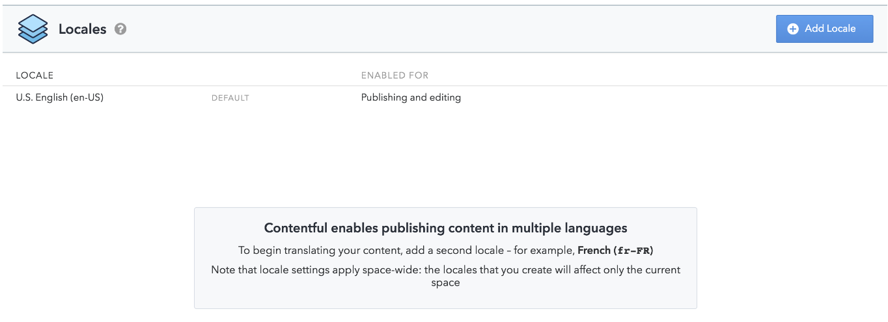
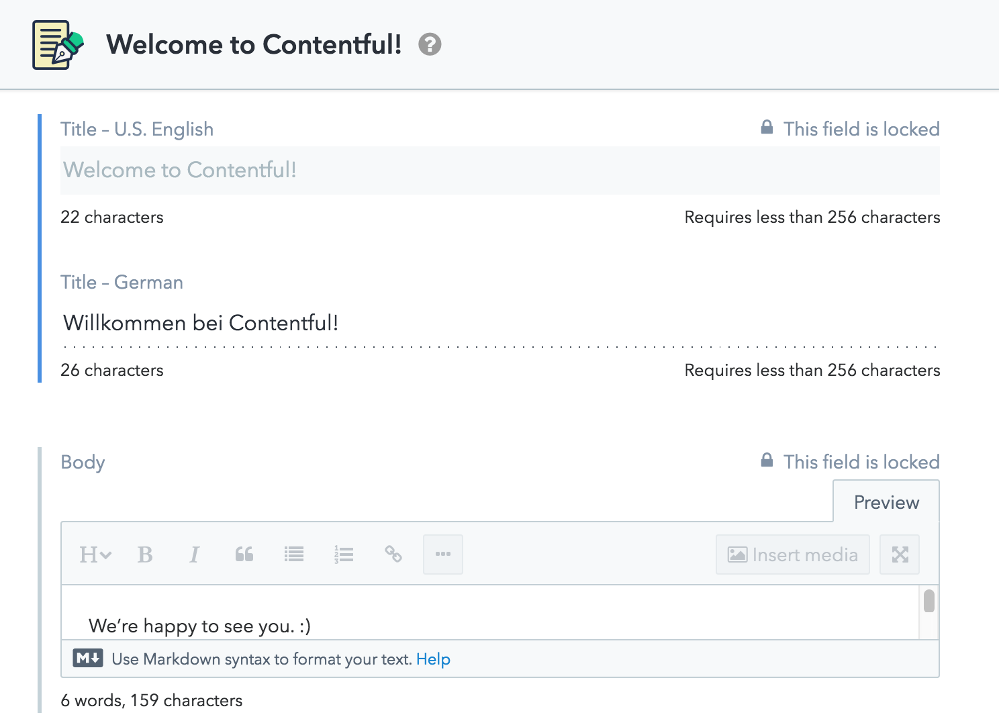
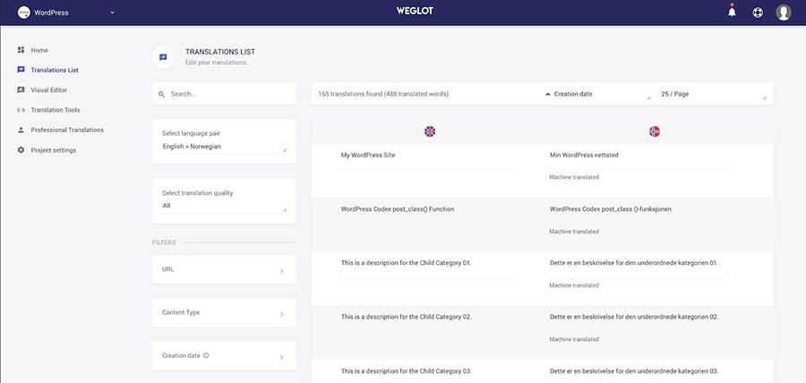
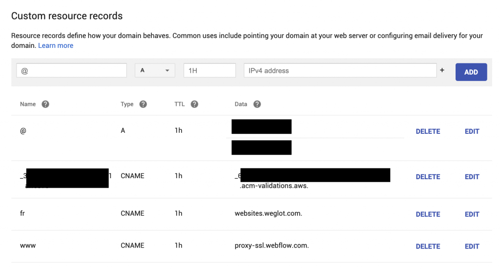

import Head from '@docusaurus/Head';

<Head>
  <link rel="canonical" href="https://www.plasmic.app/blog/react-localization" />
</Head>

Choosing how to add localization to your application can be a complicated decision, because there are so many options out there. From code-based frameworks to third-party services that automatically rewrite your HTML, there is no silver bullet for localization. At [Plasmic](https://www.plasmic.app/), we have been exploring the many options to better inform how we can support localization for our own [application](https://studio.plasmic.app/). Many tutorials assume you want to already want to use a code framework, like react-i18next, but that has implications for your team’s workflow. In this blog post we will survey different localization techniques you may be considering for your React application and discuss some of the trade-offs.

<!--truncate-->

## Why localize?

There are a number of considerations as you look to deploy your application to a global audience. First and foremost, translating the text on your app is critical to support the many non-English speaking users around the world, opening up new markets. Furthermore, displaying prices, dates, times, keyboard shortcuts, and graphics can greatly improve the user experience.

## Comparing approaches to localization in React

When choosing an approach, there are a number of factors that you may want to consider:

- **Who writes the text on your app?**
  Do engineers drive the process of choosing what text gets displayed or is there significant marketing copy that is owned by non-developers?
- **How often does the copy change?**
  Does most of the text consist of short strings that are reused throughout the application (e.g. button labels)? Or are there frequent changes to marketing copy?
- **Who does the translation?**
  Do you plan on hiring an outside agency or vendor to translate the strings? Or do you want to coordinate a crowd-sourcing effort to translate your strings?
- **How much engineering capacity do you have?**
  Is there ongoing engineering capacity in the future, or will there only be engineering support at setup time?
- **How important is website performance?**
  Optimizing your website performance may incur additional implementation costs compared to automated solutions.
- **Are there other systems that you need to integrate with?**
  Such as content management systems (CMS), databases, or web hosting platforms
- **Do you need to integrate localization below the hood?**
  HTML attributes, component props, or dynamically generated strings may also need translation in customized configurations.

In the following sections, we’ll compare the high-level categories of approaches: code-based frameworks, headless content management systems (CMS), and automated services.

|                                                | Code-based | Headless CMS | Automated Services |
| ---------------------------------------------- | ---------- | ------------ | ------------------ |
| Setup difficulty                               | High       | High         | Low                |
| Requires developers to deploy new translations | Yes        | No           | No                 |
| Performance                                    | Good       | Good         | Varies             |
| Customizability (e.g. for HTML attributes)     | High       | High         | Low                |

## Code-based localization frameworks

The natural choice for a React code base is to reach for a i18n library, such as [react-i18next](https://react.i18next.com/), [react-intl](https://formatjs.io/docs/react-intl/), or [lingui](https://www.notion.so/How-to-choose-a-localization-approach-for-your-React-application-ed1d630b18484117a1d6817ba658a687). There also framework-specific libraries, such as [gatsby-plugin-i18n](https://www.npmjs.com/package/gatsby-plugin-i18n) for [Gatsby](https://www.notion.so/How-to-choose-a-localization-approach-for-your-React-application-ed1d630b18484117a1d6817ba658a687), and [next-intl](https://www.notion.so/How-to-choose-a-localization-approach-for-your-React-application-ed1d630b18484117a1d6817ba658a687) for [Next.js](https://www.notion.so/How-to-choose-a-localization-approach-for-your-React-application-ed1d630b18484117a1d6817ba658a687). At a high-level, the architecture for most of these operate similarly, so I’ll use react-i18next code samples to illustrate the main concepts.

### Code: How it works

**Translation files**

At the core of your localization workflow are **translation files**. These can be served as static files, or imported directly into code. While each library has different specifications for this file, at a high level translation files simply consist of strings used in the application, keyed by some unique identifier.

For example in react-i18next, you might serve 1 file at `public/locales/en/translation.json` for English:

```json
{
  "title": "Welcome to react using react-i18next",
  "description": {
    "part1": "To get started, edit <1>src/App.js</1> and save to reload.",
    "part2": "Switch language between english and german using buttons above."
  }
}
```

and another file at `public/locales/de/translation.json` for German:

```json
{
  "title": "Willkommen zu react und react-i18next",
  "description": {
    "part1": "Um loszulegen, ändere <1>src/App(DE).js</1> und speichere um neuzuladen.",
    "part2": "Wechsle die Sprache zwischen deutsch und englisch mit Hilfe der beiden Schalter."
  }
}
```

**Library API**

Developers then initialize the library with your configuration. In the following example, we choose to load the translation files over HTTP and leverage a language detector that automatically sets the locale based on the `Accept-Language` HTTP header.

```tsx
import i18n from 'i18next'
import { initReactI18next } from 'react-i18next'
import Backend from 'i18next-http-backend'

import LanguageDetector from 'i18next-browser-languagedetector'

i18n
  .use(Backend)
  .use(LanguageDetector)
  .use(initReactI18next)
  .init({
    fallbackLng: 'en',
    debug: true,
    interpolation: {
      escapeValue: false, // not needed for react as it escapes by default
    },
  })
export default i18n
```

In the codebase, developers can use a translation function to look up strings for the user’s locale.

```tsx
import { useTranslation } from 'react-i18next'

function MyComponent() {
  const { t, i18n } = useTranslation()
  return <h1>{t('Welcome to React')}</h1>
}
```

Many libraries also include a React component that you can directly use in the JSX tree:

```tsx
import { Trans } from 'react-i18next'

export default function MyComponent() {
  return (
    <Trans>
      Welcome to <strong>React</strong>
    </Trans>
  )
}
```

**Build-time static analysis**

For developer convenience, most libraries also include tools to perform static analysis of the source code to extract translation keys/values into translation files.

```bash
$ i18next 'app/**/*.{js,hbs}' 'lib/**/*.{js,hbs}' [-oc]
```

While this can automate the aggregation of translation keys, developers will still need to populate translation files for each language they want to support.

**Sourcing translations**

Some teams manage translation themselves on a platform like [Crowdin](https://www.notion.so/How-to-choose-a-localization-approach-for-your-React-application-ed1d630b18484117a1d6817ba658a687). Many teams will outsource their translation to an outside service. Some services leverage automated machine translations, such as [Google Cloud Translation API](https://cloud.google.com/translate/). Other services, like [Locize](https://www.notion.so/How-to-choose-a-localization-approach-for-your-React-application-ed1d630b18484117a1d6817ba658a687), [Lokalise](https://www.notion.so/How-to-choose-a-localization-approach-for-your-React-application-ed1d630b18484117a1d6817ba658a687) or [Localazy](https://www.notion.so/How-to-choose-a-localization-approach-for-your-React-application-ed1d630b18484117a1d6817ba658a687) will help you work with translation agencies to manually translate your files. In any of these cases, a teammate simply sends their translation files to an outside service. The developer can then commit the translated files back into code for testing.

Some translation platforms provide more seamless integration into code, removing the need to manually send translation files. For example, Locize can be loaded as a “backend” plugin into i18next so that translation files are fetched directly from their CDN. This way, users can directly modify strings, source translations, and publish results all from a single web application.

```bash
import i18next from 'i18next';
import Backend from 'i18next-locize-backend';

i18next
  .use(Backend)
  .init({
    // ...other options
    backend: {
      projectId: '[PROJECT_ID]',
      apiKey: '[API_KEY]',
      referenceLng: '[LNG]'
    }
  });
```

### Code: Pros

Implementing internationalization in code (i.e. via a library) has a number of benefits

- **Customizability**: Developers have full control over how internationalization is implemented. At its core, i18n libraries simply provide a lookup table for strings, which developers can use anywhere in the codebase (e.g. HTML attributes, component props, dynamically-generated strings), anywhere in the application architecture (e.g. client-side or server-side), and at any time (e.g. at request time, at build-time, or on client load).
- **Optimized performance**: Developers can tailor the i18n setup to the performance needs of their application. When paired with static site generation (SSG), developers can implement internationalization in a way that incurs virtually no performance impact to the user.

### Code: Cons

- **Implementation cost**: Developers are required to at least initially set up internationalization for their application, which includes a number of factors to consider, such as language detection, routing, performance, and instrumentation.
- **High friction**: Because translation files are often checked into code, developers are also required to make any changes and test the results. When developers are not the primary authors of text copy, this can lead to higher friction to production.

## Headless CMS-based approaches

Headless content management systems (CMS), such as [Contentful](https://www.notion.so/How-to-choose-a-localization-approach-for-your-React-application-ed1d630b18484117a1d6817ba658a687) or [Sanity](https://www.notion.so/How-to-choose-a-localization-approach-for-your-React-application-ed1d630b18484117a1d6817ba658a687), often support writing content in multiple languages. By storing your translated content in a CMS, this simplifies content editing for non-developers and translators, who can manage content through a web application.

### CMS: How it works

Headless CMS systems, like Contentful or Sanity, require a developer to integrate their system into an existing codebase. However once set up, non-developers can make new content or edit existing content entirely from the CMS web application.

For example, in Contentful, you can manage which languages and locales your application supports.



After you specify which languages your site supports, the content editor allows you to add translations to your content.



Developers then retrieve localized content via the REST API, by specifying a `locale`parameter:

```bash
curl -X GET "https://cdn.contentful.com/spaces/<SPACE_ID>/entries/<ENTRY_ID>?access_token=<CONTENT_DELIVERY_KEY>&locale=de-AT"
```

Structured CMS data can then be used to populate the page. For example in Gatsby it might look like this ([source](https://github.com/mccrodp/gatsby-starter-contentful-i18n/blob/master/src/pages/index.de.js)):

```tsx
// src/pages/index.de.js

class IndexPage extends React.Component {
  render() {
    var deProductEdges = []
    if (this.props.data.german !== null) {
      deProductEdges = this.props.data.german.edges
    }
    return (
      <Layout data={this.props.data} location={this.props.location}>
        <div style={ marginBottom: rhythm(2) }>
          <h3>de</h3>
          {deProductEdges.map(({ node }, i) => (
            <Product node={node} key={node.id} />
          ))}
        </div>
      </Layout>
    )
  }
}

export const pageQuery = graphql`
  query PageDeQuery {
    site {
      siteMetadata {
        languages {
          defaultLangKey
          langs
        }
      }
    }
    german: allContentfulProduct(filter: { node_locale: { eq: "de" } }) {
      edges {
        node {
          id
          contentful_id
          node_locale
          productName {
            productName
          }
          image {
            resolutions(width: 75) {
              ...GatsbyContentfulResolutions
            }
          }
        }
      }
    }
  }
`
```

### **How are CMS and code-based approaches different?**

CMS-based approaches and code-based approaches share a number of similarities. Both store translated content as structured data, which developers can retrieve by locale. There also exist easy-to-use web applications to manage translated data.

However they differ predominantly in the developer interface, leading to drastically different code architectures. For code-based approaches, developers operate at the granularity of strings. Every string needs to be wrapped with a call to a i18n lookup function to find the proper translation.

In contrast, CMS systems allow you to define content types that embody a group of data, such as a blog post or product entry. When you retrieve data from a CMS, you get the result as a translated object, which you can use directly. While these APIs are different today, I anticipate future libraries to take from the best of both worlds.

### CMS: Pros

- **Customizability**: Developers have full control over how internationalization is implemented and how localized content is displayed.
- **Optimized performance**: Developers can optimize the i18n setup to suit the performance needs of their application, similar to code-based frameworks.
- **Easy editing**: Because data is stored in the CMS, non-developers can easily make changes to content. When paired with webhooks, the CMS can also trigger builds and deployments, all without getting a developer involved.

### Code: Cons

- **Initial setup costs**: Developers are needed to integrate localized content into the application, which will vary depending on application.

## Automated services

There are a number of services that take it another step further, automating the collection of all strings from a live website in production, as well as dynamically rewriting the page with translations, such as [Weglot](https://weglot.com/), [Localize](https://localizejs.com/), and [Gtranslate](https://gtranslate.io/).

### Automated: How it works

These automated services typically include a library that users can add to their website. For example, the Weglot integration involves adding the following script to your document `<head>`([Source](https://support.weglot.com/article/333-javascript-integration-setup)).

```bash
<script type="text/javascript" src="https://cdn.weglot.com/weglot.min.js"></script>
<script>Weglot.initialize({ api_key: 'YOUR_API_KEY' }); </script>
```

On page load, this script will detect all of the visible strings in your web pages and load them into a dashboard. The service will facilitate translations (either by machine or humans), which can all be managed from the web app. Once strings have been translated, future loads of the web page will also detect the user’s locale and automatically rewrite strings in the DOM to reflect the translations.



Some services provide a server-side option. Instead of rewriting strings via client-side scripts, you configure your DNS to point to a translation proxy. This proxy server will similarly detect strings, rewrite the page, and cache content, which may lead to better website performance.



Note: Many of these services can also be used from a developer API without the integration script. In this case, you can treat the service similarly to a CMS like above.

### Automated: Pros

- **Simple setup**: Setup simply involves adding a script tag into your document header.
- **Easy to use**: Because strings are automatically detected, users can manage translations without changing their existing workflow.

### Automated: Cons

- **Performance**: If using client-side scripts, pages are dynamically rewritten at runtime on the client, which may result in noticeable delays to the user.
- **Limited customization**: Because the integration scripts embody hard-coded functionality, there is often less ability to adapt the library for customized functionality.

## Leveraging Plasmic for localization

[Plasmic](https://www.plasmic.app/) is a visual builder for the web, which makes it easy for content editors and designers to build and iterate on pages in a WYSIWYG editor, rendered within your existing website. Similar to other headless CMS systems, Plasmic enables you to support multiple locales for each webpage by [creating new variants](https://www.notion.so/High-Performance-Personalization-with-Next-js-Middleware-ce9f008bc11f4ec392fa2ee1fe580e7a). This way, non-developers can visually design and edit the entire webpage in a collaborative environment.

However, Plasmic’s support for localization goes much deeper. We can also import your translation function from your code-based localization framework directly into Plasmic as a prop.

```tsx
import { useTranslation } from 'react-i18next';
...
const { t, i18n } = useTranslation();
const translator: PlasmicTranslator = (key, opts) => t(key, { defaultValue: opts.message });
...
return <PlasmicRootProvider translator={translator}>...</PlasmicRootProvider>
```

Once registered, you can leverage these localized strings from your Plasmic project! Plasmic opens up the ability to leverage the best of both worlds from code-based approaches to headless CMS’s. For more details, see our [Plasmic localization guide](https://www.notion.so/High-Performance-Personalization-with-Next-js-Middleware-ce9f008bc11f4ec392fa2ee1fe580e7a).

## Choosing an approach

No single solution will be best approach in all use cases. Often times, the decision relates to where you want a developer to sit in the workflow, if at all. Automated solutions provide the simplest user experience, but may not work well for all use cases. Code frameworks and headless CMS solutions provide more customizability, but require developers to at least perform the setup. Regardless of which approach you choose, localization is one of the best ways to quickly open up new markets to your application.
