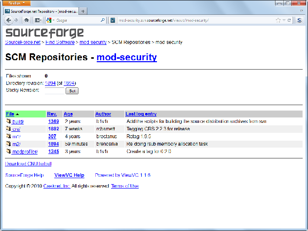
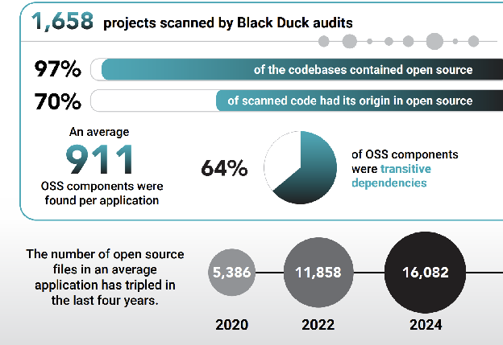

import Head from '@docusaurus/Head';

<Head>
  <link rel="canonical" href="https://docs.oso.xyz/blog/network-intelligence/" />
</Head>

_Revolutionize the data industry with open source principles_

<!-- truncate -->

For decades, the data industry has operated under a similar model, vertically integrated silos with data licensing between parties. While we've built incredible technology under this model, we have yet to fully capture the opportunity of open source innovation. The open source software movement has shown that there is a different, more powerful way to build productive digital goods. The data business is waiting to be disrupted, just as software has been since the 1990's.

Open source can fundamentally transform how we collaborate on data in the global economy. Data scientists across the industry ought to be able to collaborate on data models as simply as software developers use `npm publish` and `npm install`.

## Data today: who can build the tallest data silo?

Over the last couple decades, data infrastructure has grown exponentially in scale and sophistication. From the databases of the 20th century to the data lakes of the 21st century, massive amounts of data infrastructure now power companies of all sizes. As many have said before, "data is the new oil". Most businesses use data pipelines to understand their business, from measuring what their customers are doing, to understanding internal productivity, all powering daily strategic decisions. This is exponentially more true in the age of LLMs and AI, where data pipelines also train sophisticated models that write and improve all of the code around us.

However, the model in which companies collaborate around data have largely stayed the same over this entire time period. Companies are incentivized to grow the quantity and quality of their own internal datasets. In order to build a competitive edge, companies build large sophisticated data pipelines with the help of a growing data industry. Because everyone runs their own data infrastructure, collaboration often requires complex licensing and moving data around to run in your proprietary data warehouse. Exacerbating the problem,

- Data is expensive to move. Most cloud providers charge extractive network egress fees to keep data on their platform.
- Every data warehouse has their own conventions (e.g. SQL dialect or semantic layer)
- Every organization attaches different semantic meanings, which requires complex pipelines to clean, organize and join with your own data.
- Every data platform has their own additional choke points for sharing data.

This friction has led to many lost opportunities. For example,

- Potential life-saving medical studies that are stymied by lack of access to data
- Inefficient policy outcomes in security, education, or healthcare due to lack of visibility or uncoordinated effort.
- Scientific research that can only be done by a small number of internal employees with access to the data.

If the data industry operated more like the software industry, where anyone in the world could collaborate and share on the most sophisticated frontier data models, it would unlock huge opportunities in every corner of society, from business to science to government.

## How open source changed software

In the 1990's, software development largely worked in a similar way. Each company had their own proprietary development stack, which included everything from the software toolchain to even the data structures that engineers used. Because many of the best software tools were internal to a company, it wasn't uncommon for engineers to choose jobs in part based on access to software development tools. When you needed software from another company (e.g. a database), you would license the code and run it on your own infrastructure. In these early days, open source development looked really different. Developers would share tarballs of source code on public websites like SourceForge, or email code patches to each other. Not unlike how we share datasets on HuggingFace today.

   
([Source](https://www.feistyduck.com/library/modsecurity-handbook-free/online/ch02-installation.html))

Over the last 20 years, software development has completely changed. The best developer tools are nearly all open source now. Every developer on the planet has access to the most sophisticated developer tools on package managers like npm, crates, and PyPI. Any developer can get started building a fully featured application in less than a minute. Compared to the 90s, it is incredible what a student can build in a weekend hackathon. Small startup teams can now rapidly build competitive products that once required the resources of a large enterprise organization.

    
[Source: Black Duck OSSRA Report](https://www.blackduck.com/resources/analyst-reports/open-source-security-risk-analysis)

This dynamic has fundamentally changed how the software industry works as well. Recent studies have shown that over 70% of all commercial code bases came from open source ([1](https://www.synopsys.com/software-integrity/resources/analyst-reports/open-source-security-risk-analysis.html#introMenu), [2](https://www.linuxfoundation.org/blog/blog/a-summary-of-census-ii-open-source-software-application-libraries-the-world-depends-on)). The AI models powering agentic coding are only made possible due to the wide prevalence of high-quality free and open source code. It is no exaggeration to say that the accelerating pace of innovation in tech is powered by open source software. The logic follows that the contrapositive is also true: If we are not seeing as high of a rate of innovation, it is because we are not seeing open source principles leveraged to its fullest potential.

A big reason why so many developers love the open source movement is because it fundamentally created a new, empowering relationship with software development. Compared to proprietary development practices, we get the following:

- **Frictionless access**: Getting access to the latest technology is as easy as a single command, like `npm install`. If a package author wants to charge for a value-added service, it is as simple as entering your credit card into a website.
- **Universal catalogue**: Within a language ecosystem, there is one place where you can find every available package. For Node.js, it's the npm registry. For Python, it's PyPI. For Rust, it's crates.
- **Standardized dependencies**: Within a programming language, there is usually one simple way to import a package and use it. There is also one standardized way to publish and version software for other people to use. This made software development a positive-sum community effort, where we could more easily rely on the work of others.
- **Software forks**: If any of the software that you depend on is not meeting your needs (e.g. if the maintainer quits), you can always fork the software and give it your own custom flavor.
- **Usage-based deployment**: When you're ready to deploy an application or service, there are a wide range of platforms that charge intuitive usage-based pricing at fair, low prices, like Netlify, Vercel, and Cloudflare. While this isn't a property of open source software, cloud platforms have been a critical enabling technology for open source innovation.

These are the same reasons why AI agents love open source libraries as well. Across the board, usage of open source libraries is [exploding](https://npmtrends.com/) as AI agents automate the work of plumbing libraries together to build something. Unlike humans, agents don't suffer from the ego-driven bias towards "[not-invented-here](https://en.wikipedia.org/wiki/Not_invented_here)" syndrome. They save energy where they can.

## Building Network Intelligence

At [oso.xyz](https://www.oso.xyz), we want to see a similar transformation to the world of open source data engineering and analytics, a future we like to call **"network intelligence"**. What are the missing components to make open source data analysis as amazing as open source software development for the next generation of strategic thinkers?

### Universal data marketplace

While many data marketplaces do exist, data coverage is scattered across many different ecosystems. Often data catalogues are tied to a specific data platform that have a large upfront cost to even get started. Others require accessing it through a complicated proprietary service. As far as I'm aware, there are no marketplaces with wide data coverage that are as simple as an `npm install`.

The data marketplace should be:

- **Built on open formats**, like Parquet
- **Interoperable with any data platform**, and not bound to a particular data warehouse solution.
- **One-click access**: What is the equivalent of `npm install` in the data world? We should expect many providers to charge for data, which should be as simple as entering a license key from a self-service checkout flow.
- **Wide coverage**: This may be the hardest to satisfy, as it isn't a technical requirement. Many data companies prefer to control their sales pipelines end-to-end. Coverage will only come if the broader community chooses this open source marketplace as the schellingpoint for data distribution.

### Standardized model dependencies

We have largely converged on a few open standards for data. SQL is the common language for handling structured data. Open source formats like Parquet and Apache Arrow have become universal.

| Task              | PostgreSQL          | SQL Server  | MySQL      |
| ----------------- | ------------------- | ----------- | ---------- |
| Limit rows        | `LIMIT 10`          | `TOP 10`    | `LIMIT 10` |
| String concat     | `\|\|`              | `+`         | `CONCAT()` |
| Current timestamp | `CURRENT_TIMESTAMP` | `GETDATE()` | `NOW()`    |

_Even basic syntax varies greatly across SQL dialects_

The challenge comes from a 90% standard. Every data platform has its own SQL dialect, data frame implementation, and high-level abstractions like the semantic layer. Conversion facilities exist, but as every data engineer can empathize, there are always painful edge cases to deal with. Compared to code, businesses have even higher expectations for their data pipelines. Even 90% interoperability or accuracy could be catastrophic to business outcomes, when the data drives real decisions.

### Forkable open source data, models, and dashboards

It is encouraging to see the budding ecosystems of open-source dashboards, on platforms like Jupyter, GitHub and Colab. It feels a lot like Linux applications of the 90s: less sophisticated than their proprietary counterparts, but clearly a growing force that will only get better over time.

GitHub has been an enabling force for data science and engineering, as much as it has for software at large. However, it misses the opportunity to collaborate on both the data and the code, as opposed to just the code. In analytics, the code is relatively meaningless without seeing how it works in the context of the data you're analyzing. In order to deeply collaborate, we need the ability to more easily share data with the code, whether it is raw data, data from intermediate models, or cached results. In order to collaborate on building/expanding what you've done, you need the ability to reproduce what has been done before.

### Mass Market Borderless Data Platform

Most data platforms today, like Snowflake and Databricks, are geared towards enterprise sales. This means high friction to get started and workflows that are geared towards an internal data science team. If you are deeply embedded in a system, it is difficult to leave, between data formats, data connections, and network egress fees. Compare and contrast that to a simple website, where moving hosts can be as simple re-deploy and changing DNS records. Data infrastructure companies are incentivized to maximize switching costs, while increasing their fees.

An ecosystem of interoperable low-cost data platforms would have enormous impact on lowering the cost of insight and accelerating the pace of innovation towards an intelligence revolution. While there will continue to be large enterprise providers for the foreseeable future, open data, open models, and low friction deployments can be a cornerstone of startup innovation as it has been in the SaaS industry.

These standardized protocols and interfaces would also be a natural place to implement clear data policies, like GDPR. With clear transparent data lineage and provenance, it makes it easier to enforce end to end guarantees on data privacy and access control.

## Why an open source data movement can be even more powerful than the open source software movement

A stronger open source data movement can bring similar benefits to society as open source software, but with potentially wider reaching consequences. Software fundamentally transforms how society can be productive. Data is the superset that fundamentally transforms how society makes decisions.

### Democratize access to quality data

Open source movements are at their core about expanding access to foundational knowledge technologies. When you give anyone in the world access to the same tools as industry incumbents, you unlock innovation in ways that benefit everyone. Suddenly, students can create startups that rival current hegemons. Academics can push science forward in new ways. Labs outside of the US can train AI models that compete on performance. Open source improves the capacity for anyone to compete at the frontier. It opens up equitable economic opportunities, while increasing global competition.

### Code is just a form of data

Agentic code turns the software engineering discipline into a data pipeline. Source code, often from open source software, is processed in data pipelines to train LLM models. Then, users combine LLM models with text context, to create more code. Over time, humans will spend less time in the critical path of coding, as agents produce and review code autonomously. When we design systems that combine AI training, with software production, and data intelligence, we'll unlock systems that recursively self-improve in fundamentally different ways compared to the coding agents of today.

### Everyone needs caching, even AI

At the core, our open source thesis is ultimately about the benefits of sharing. Even if AI agents were capable of writing any piece of software without human intervention, agents and humans will continue to share, because publishing is a simple mechanism to cache progress. This is even more important in the world of big data, where just running a single job can cost thousands of dollars in raw compute resources. The scarce resources of hardware and energy will dominate in a future of abundant code. Sharing results allows both humans and agents to more rapidly build on top of existing progress. This is why open ecosystems can often out-innovate closed ecosystems.

### Accelerate global innovation

We believe that open source is the most powerful force behind accelerationism. We often over-credit companies with innovation, which leads to a near-sighted view of public goods. In the US, we often take public goods for granted, and rely on tech CEOs to push the future forward.

When Linux came out in the 1990's, the media was fixated on what it would do to Windows and other proprietary operating systems. If we gave away a free operating system, what would that do to one of the wealthiest companies in the world? Does open source destroy economic value? We strongly believe that open source grows the pie by orders of magnitude in ways we cannot predict.

The brightest experts in the world could not have predicted the cloud revolution, and how quickly technologies like Docker, Kubernetes, Xen, and KVM have completely changed how we deploy software in the cloud. No one could have predicted how quickly Android would put a computer in the hands of over half of the world's population. Our aggregate capabilities built on Linux are exponentially greater now than the past eras of PCs or mainframes, and it happened significantly faster because of open source. We have only begun to see what it looks like when more people are empowered with open source AI models. Whether you agree or not, open source has already won. 99% of companies use it, and over 70% of code deployed to production today comes from the open source community ([1](https://www.synopsys.com/software-integrity/resources/analyst-reports/open-source-security-risk-analysis.html#introMenu), [2](https://www.linuxfoundation.org/blog/blog/a-summary-of-census-ii-open-source-software-application-libraries-the-world-depends-on)). It is the foundation of the entire global economy, and that will only expand in the future with AI.

Open source data can also transform science and knowledge discovery. With more open access to data, we will understand the universe and all its mysteries in increasingly faster ways. Reproducible science based on a shared data foundation will drastically improve science past the low-bandwidth way we collaborate today, via unstructured manuscripts and papers.

It can transform collective strategic decision making, too. This is not limited to just the corporate board room. Imagine a future where political and legal systems can operate on a greater wealth of public data, and where the public can directly make improvements to policy based on a shared foundation of understanding and knowledge.

### Towards open collective intelligence

The reason why open source software is powerful, is because of the deep interconnected dependency tree. It is what makes us able to easily collaborate and depend on the works of others. It is what makes modern software development a positive-sum endeavor. Recent studies have shown that on average, 64% of open source usage came from transitive or indirect dependencies ([1](https://www.synopsys.com/software-integrity/resources/analyst-reports/open-source-security-risk-analysis.html#introMenu)).

Data and insights have yet to reach this level of societal-wide collaboration. But when we do, we'll reach closer to the ideals of collective intelligence, where humans can work together to achieve greater ends like a superorganism.

## Building a digital superorganism

When we pair open source data with open source software, we join 2 symbiotic components of a great whole. Software is productive in nature; it exerts influence on the world. Data is analytical and observational in nature; it seeks to understand what is happening in the world. In my dreams, I see an image of a mythological giant. The open source software movement is like strength training. Old repositories are replaced with new ones, like muscle fibers. When we give the giant an open source brain, the resulting superorganism becomes a self-improving force. One that can see the world, act, see what happens, and do better over time.

Will any company still be here 1000 years from now? Maybe it will, maybe it'll get swallowed for pennies on the dollar like DEC was in the 1990's. Corporate powers tend to come and go, but free knowledge, the underlying principle of open source, tends to stay for centuries to come.
