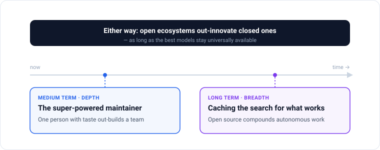
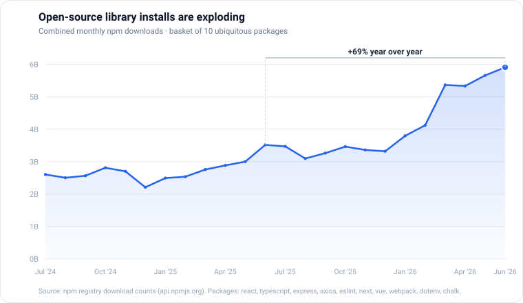

_An opinionated answer to what open source becomes once the AI writes the code:
how it caches society's progress, and why a single maintainer with taste will
soon out-build entire teams._

<!-- truncate -->

## What is open source once AI writes the code?

What does **open source in the AI age** look like once the machines are writing
most of the code? Microsoft's CEO already says [20–30% of the
code](https://techcrunch.com/2025/04/29/microsoft-ceo-says-up-to-30-of-the-companys-code-was-written-by-ai/)
in the company's repositories is written by AI, and that fraction only climbs
from here. So the question sounds almost rhetorical: if a model can generate any
library you need on demand, why would anyone bother publishing one?

I think that intuition is exactly backwards.

Writing code used to be the expensive part. When it stops being expensive, the
bottleneck doesn't disappear. It moves. The hard question is no longer _can we
build it_ but _what is worth building, and how do we avoid everyone redoing the
same work_. That is precisely what open source is for.

So open source doesn't fade in the AI age. It matters more. My answer for _why_
comes in two parts, a breadth answer and a depth answer, and the interesting part
is how they trade off over time. (I've made [the parallel argument for
data](/posts/network-intelligence) elsewhere; here I mean software.)

## Two answers, and when each one matters

Here are the two answers, each in a sentence.

**Breadth: open source is how society caches its progress and shares it — a
breadth-first search over what's worth building.** Every published library is a
solved subproblem that no one else has to solve again.

**Depth: a single maintainer with taste, amplified by AI, will soon out-build
entire teams.** One person with good judgment can produce hundreds of
high-quality libraries, faster and better than a room full of engineers.

They aren't rival answers. They're the same phenomenon seen at two points on a
timeline:

- **Medium term — depth.** We still need human taste to steer, or the search
  degenerates into a wasteful crawl over every possible branch. The maintainer
  with taste keeps it tractable.
- **Long term — breadth.** Once we trust AI to design and experiment on its own,
  the volume of exploration explodes, and caching what works in the open is what
  lets the gains compound.

The next two sections take each answer in turn, starting with the one closer at
hand.

## Depth: the super-powered maintainer

Give a maintainer with genuine taste an army of tireless coding agents, and what
do you get? Not a hundred mediocre libraries. Hundreds of _good_ ones. **In the
medium term, the most productive unit in open source won't be the team. It will
be the individual with taste.**

Here's the inversion: when generating code is cheap, code is no longer the scarce
input. _Judgment_ is. Knowing what to build, what "good" looks like, and, above
all, what to throw away is the constraint. Taste is what prunes the search tree
down from everything-possible to everything-worth-having. An agent can write a
thousand variations; only taste picks the one worth publishing.

This isn't a fantasy that waits on future models. It's already visible in the
pre-AI world. Sindre Sorhus, one developer, [actively maintains over 1,000 npm
packages](https://sindresorhus.com/about), building blocks depended on by millions
of projects. He did that _before_ agents could carry the plumbing. Now imagine the
ceiling once the boilerplate, the tests, the release chores, and the issue triage
are largely automated.

The exciting version: a small number of 100x engineers, each with taste, trading
ideas and setting the direction of whole ecosystems. Fewer hands, more leverage,
better libraries.

There's an obvious open question, who pays these people, that I won't resolve
here; I've [written separately](/posts/prosperous-software) on how we might fund
the maintainers everything else depends on. The point for now is simpler: **the
super-powered maintainer is coming, and taste is their superpower.**

## Breadth: how society caches its search for what works

Think of open source as a **cache**. Publishing a working library is caching a
solved subproblem so that no one, anywhere, has to solve it again. The global
commons of open source is society's memoized answer to _what works_.

Why does that make it a _breadth_-first search? Because without a shared cache,
every actor re-explores the same branches alone: the same JSON parser, the same
auth flow, the same date library, written a million times over. Open source lets
the whole ecosystem explore in parallel and _keep_ the wins. (This is where depth
meets breadth: the maintainer's taste from the last section is what keeps that
search from being a blind, wasteful crawl.)

There's a durable economic reason caching wins, and it survives even as AI gets
cheap. The cost of producing software is falling fast, but it will never reach
zero, because model inference has a real, recurring cost. **As long as storing a
result is cheaper than recomputing it, caching pays.**

And it's already playing out in real time. Coding agents conserve effort exactly
the way a good engineer does: they reach for an existing dependency instead of
re-deriving or vendoring the code inline. The result is a visible surge in
open-source library installs.

_Combined monthly npm downloads for ten ubiquitous packages (react, typescript, express, axios, and others). [Source: npm registry download API](https://api.npmjs.org/downloads/)_

Install volume for that basket is up roughly **69% year over year**, with the
sharpest climb in 2026. I'll be honest about what the graph does and doesn't show:
raw download counts include CI and automation, so this measures install
_activity_, not distinct developers, and the claim that _agents_ are driving it is
my interpretation, not something the chart proves. But the direction is
unmistakable.

Now extrapolate. When entire software teams go autonomous, designing and
experimenting without a human in the loop, the volume of exploration explodes.
Caching what works, in the open, becomes the only way that exploration compounds
across the world instead of being repeated behind a thousand closed doors.
**Depth is the medium-term face of this; breadth is the long-term one. They're
the same thing.**

## As software gets cheaper, open becomes the default

There's a second force pushing the same direction, and it comes from the market,
not the technology.

As the cost of producing software collapses, people have started predicting the
**death of SaaS** — a "SaaSpocalypse." The logic is simple: when a coding agent
can rebuild your tool over a weekend, buyers grow far less willing to pay rent for
it. a16z devoted [an entire episode](https://a16z.com/podcast/anish-acharya-is-saas-dead-in-a-world-of-ai/)
to asking whether SaaS is dead in a world of AI; as they put it, "SaaS switching
costs are actually going down thanks to coding agents." The headlines are already
[declaring the collapse](https://www.forbes.com/sites/donmuir/2026/02/04/300-billion-evaporated-the-saaspocalypse-has-begun/).

Follow the price. When software is cheap to produce and easy to substitute, its
market price drifts toward its falling cost, and tolerance for lock-in and markups
drops with it. Rent-seeking gets harder.

Now watch what that does to the release decision. **If a piece of software is hard
to monetize anyway, keeping it closed buys you almost nothing.** The friction of a
proprietary license is guarding a shrinking rent. The rational move flips toward
releasing it in the open, where you capture reputation, distribution, and
contributions instead.

So falling production cost doesn't threaten open source. It _feeds_ it. The same
force that ends easy SaaS rents pushes more code into the commons.

I don't want to overstate this; it's a directional prediction, not a law.
Monetization doesn't vanish. Support, hosting, proprietary data, and genuine
value-added services still command a price. But for the vast middle of software,
the default tilts open.

## Why open ecosystems out-innovate closed ones

Put the two mechanisms together, super-powered maintainers and a shared cache of
what works, and you reach the thesis this whole essay is building toward. **An
open ecosystem explores more of the space, and compounds its wins faster, than any
single closed organization can.** No company, however well-funded, out-innovates
the entire world working in parallel and keeping every result.

If you doubt it, look at how we got here. Modern AI is itself the strongest case
study for the argument.

The technology now writing our code was built in the open. The Transformer, the
architecture under every frontier model, was published openly in 2017 as
"[Attention Is All You Need](https://arxiv.org/abs/1706.03762)." The labs now
racing to build proprietary models grew directly out of an arXiv-and-conference
culture where the core ideas were shared freely, the moment they were found.

That's the punchline, and it's recursive: **AI is both a product of open
ecosystems out-innovating closed ones, and the tool that will accelerate the next
round.** Open ideas built the thing that is now supercharging open source. And the
opening of the technology behind it is only beginning.

## The bet: the best models stay universally available

Everything I've argued rests on a single assumption, and I want to name it plainly
rather than smuggle it in.

**The whole thesis is conditional on the best models staying universally available,
not locked away.** Open source out-innovates closed only as long as the frontier's
most capable models stay broadly accessible to the people and agents doing the
building. Lock the best models behind a wall, and the open ecosystem loses its
engine.

So why do I take the bet? Two reasons.

First, the frontier has stayed reachable so far. The leading closed labs expose
their best models through APIs, and open-weight models have kept surprisingly close
behind. One mechanism there is distillation, training a smaller model on a larger
one's outputs, a decades-old and legitimate technique, if contested at the edges.
Contested enough that OpenAI has [formally accused
DeepSeek](https://www.bloomberg.com/news/articles/2026-02-12/openai-accuses-deepseek-of-distilling-us-models-to-gain-an-edge)
of distilling its models to catch up. That's an _allegation_, not an adjudicated
fact, but the fact that it's plausible tells you how hard the frontier is to keep
sealed.

Second, AI is its own precedent. The field advanced fastest precisely when
research flowed freely, and that same pressure toward openness now applies to the
models themselves.

Here's the honest failure mode, the thing that would prove me wrong: if frontier
capability concentrates in a few hands and _stays_ locked, with access metered,
weights sealed, and the gap widening, then the open ecosystem stalls and the
closed players win. That's the bet. You can hold me to it.

## An invitation

Strip it back and the answer is simple. **Open source in the AI age is how we
cache and compound humanity's search for better software**, pruned by the taste of
a new kind of super-powered maintainer in the medium term, and, in the long run,
the only way an autonomous, experimenting world keeps its discoveries. If the best
models stay open, no closed ecosystem keeps up.

I hold this as a conviction, but it's still a bet, resting on that one assumption
and on a future that hasn't arrived yet.

So I'd genuinely like to know where you think I'm wrong. That's the most
open-source thing I can do with an idea: publish it, and let better ones build on
top.
