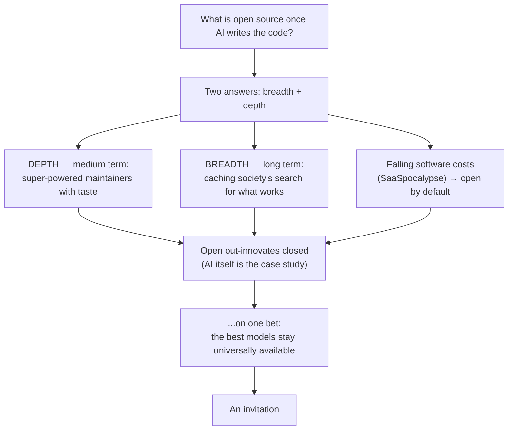

_An opinionated answer to what open source becomes once the AI writes the code:
how it caches society's progress, and why a single maintainer with taste will
soon out-build entire teams._

<!-- truncate -->

<!-- PLAN: POST OVERVIEW · STATUS: OUTLINE

## Overview
When AI can write most of the code, the obvious question is whether open source
still matters. This post argues it matters more, not less, and gives an
opinionated two-part answer: open source is how society *caches* progress and
shares it (breadth), and in the medium term it will be driven by super-powered
maintainers with taste who out-build whole teams (depth). The two answers
resolve along a timeline — depth dominates the medium term, breadth becomes
essential once software teams go autonomous. Either way, the open ecosystem
out-innovates any closed one — on one condition. Falling software costs only
reinforce the shift: as easy SaaS rents collapse, releasing open becomes the
rational default.

## Reader & Goal
For technically literate builders, open-source contributors, and people thinking
about where software is heading in the AI age. They already believe open source
is valuable today; they don't yet have a crisp picture of what it becomes when AI
writes the code. By the end they should be able to state the two answers (breadth
= caching society's search; depth = super-powered maintainers), see how each maps
to a timeline, and understand the single assumption the whole argument rests on —
and decide whether they take that bet too.

## Angle / Thesis
Open source in the AI age is how society runs a breadth-first search on
innovation — caching what works so it can be shared — and in the medium term it
will be powered by individual maintainers with taste who produce more, and
better, than entire teams. The open ecosystem will out-innovate any closed one,
conditional on the best models staying universally available.

## Key Claims & Sources
Ordered highest-stakes / hardest-to-verify first.

- **The models-stay-open assumption is the load-bearing claim.** The whole
  "open out-innovates closed" conclusion is conditional on the best models
  remaining universally available rather than locked away. Handle as an
  EXPLICIT, FALSIFIABLE BET stated in prose — not asserted as established fact.
  Supported by the verifiable observation that closed frontier labs have so far
  exposed APIs, and (softly) that open models improve by distilling from other
  models. Source for the bet itself: none — it is the author's stated prediction.
- **"Open models distill from other (including closed) models."** CONTESTED and
  legally spicy (e.g. the DeepSeek-distilled-from-OpenAI allegations). Keep SOFT:
  present as one mechanism among several, hedged, framed as allegation/reported —
  never as settled fact. `[add source: reporting on distillation allegations, e.g.
  DeepSeek/OpenAI — frame as "reported"/"alleged"]`
- **Frontier AI was itself built on open research.** The Transformer architecture
  behind modern LLMs was published openly. Source: Vaswani et al., "Attention Is
  All You Need," NeurIPS 2017 — https://arxiv.org/abs/1706.03762 . Reinforce with
  the arXiv + open-conference (NeurIPS/ICML) culture the labs grew out of. This is
  the clean case study; lead with it.
- **A single maintainer already runs over 1,000 npm packages.** Existence proof
  that "one person, thousands of libraries" is real, not fantasy. Sindre Sorhus's
  npm profile lists ~1,284 packages. Source: https://www.npmjs.com/~sindresorhus
  (corroborated: https://sindresorhus.com/about ). Cite conservatively as "over
  1,000." `[verify count is still 1,000+ at publish time]`
- **Closed frontier labs expose their best models via API.** OpenAI, Anthropic,
  Google et al. General, easily verifiable knowledge; light or no citation needed.
- **Open-source library usage is climbing as AI agents automate plumbing.** The
  usage TREND is real (see https://npmtrends.com/ ); the attribution to AI agents
  is the author's INTERPRETATION — frame accordingly, don't present causation as
  measured. `[interpretation, not a measured causal claim]`
- **Caching stays economically rational because production cost never hits zero.**
  LLM inference has a real, recurring cost; as long as storing a result is cheaper
  than recomputing it, caching pays. This is an economic/logical argument, not a
  measured figure — present as reasoning. No external source required.
- **The "death of SaaS" / "SaaSpocalypse" and falling-price argument.** Others have
  predicted software rents collapsing as production cost falls; the author's read is
  that this pushes more code toward open by default. Attribute the discourse to
  others (not the author's coinage) and frame the open-by-default consequence as a
  directional market-forces prediction, not a law. `[add source: a representative
  death-of-SaaS / SaaSpocalypse piece]`
- **The two-answer thesis and the medium-/long-term predictions** (super-powered
  maintainers; fully autonomous software teams; caching mattering most once teams
  are autonomous) are the author's OPINION and forecast. Framed as thesis, not
  fact. No source claimed — and none implied.

Deliberately NOT used: the "70%+ of production code is open source / 99% of
companies use FOSS" house stat. It anchors two prior posts (network-intelligence,
prosperous-software); reusing it a third time as a centerpiece would make this
read as a rehash. May appear once as a glancing callback at most.

## SEO & Internal Links
- **Target keyword:** "open source in the AI age" (in title, slug, description,
  and the opening line).
- **Meta description:** drafted in frontmatter above.
- **Internal links (see-also, NOT load-bearing — this post stands alone):**
  - `/posts/network-intelligence` — the *data* companion to this software-focused
    piece; link once as "I've made the parallel argument for data" so readers see
    the boundary, not as a dependency.
  - `/posts/prosperous-software` — where the "who funds the super-powered
    maintainer?" thread points; optional see-also in the depth section.
- This blog (raymondcheng.net) is the canonical home. No external canonical block.

## Success Criteria
- [ ] Reader can restate both answers and how each maps to the timeline
      (depth → medium term, breadth → long term).
- [ ] "Open out-innovates closed" is argued with AI itself as the case study.
- [ ] The models-stay-open assumption is stated as an explicit, falsifiable bet —
      not smuggled in as fact.
- [ ] The distillation claim stays hedged; no unsourced assertion is presented as
      established fact.
- [ ] Keyword "open source in the AI age" appears in the title, description, and
      opening lines.
- [ ] The falling-cost / SaaSpocalypse argument is framed as a market-forces
      prediction (not a law), and the caching-economics point (storage cheaper than
      recompute) grounds why caching persists as production cost falls.
- [ ] Reads as fully standalone (no reliance on network-intelligence) and is
      clearly differentiated: this is about open-source *software*, not data.
-->

# Open Source in the AI Age

## What is open source once AI writes the code?

<!-- PLAN
Objective: Pose the question sharply and stake the claim that open source matters
MORE in the AI age, not less — setting up the two-part answer without yet giving
it away. Establish "why now."
Beats:
- The intuition to defeat: if AI can generate any library on demand, why share
  code at all? Doesn't abundance of generated code make open source obsolete?
- Flip it: the bottleneck stops being "can we write the code" and becomes "what's
  worth building, and how do we not all redo the same work." That is exactly what
  open source is for.
- State the shape of the answer to come: there's a breadth answer and a depth
  answer, and they play out over a timeline.
- Work the exact target phrase "open source in the AI age" into the opening
  line, naturally — it anchors the title, slug, and description.
- Keep it tight and provocative; this is the hook that earns the rest.
Evidence & Sources:
- Observation that AI coding assistants now generate large fractions of new code
  and lean heavily on open-source libraries (context/color; keep light — the
  70% house stat is deliberately reserved, see overview). [add source only if a
  clean, current figure is used — otherwise keep as qualitative observation]
- Optional single see-also to /posts/network-intelligence to mark the boundary:
  "I've argued this for data elsewhere; here I mean software."
Builds on / See also: None (opening section). See also: network-intelligence
(mark the data-vs-software boundary, one link).
Target: ~250 words · Core
-->

## Two answers, and when each one matters

<!-- PLAN
Objective: Deliver the thesis in one place — the breadth answer and the depth
answer — and introduce the timeline that orders the rest of the post (depth in the
medium term, breadth in the long term).
Beats:
- Breadth answer, in one sentence: open source is how society caches progress and
  shares it — a breadth-first search over what's worth building.
- Depth answer, in one sentence: in the medium term, a single maintainer with
  taste, amplified by AI, will out-build entire teams.
- The timeline that reconciles them: depth dominates the medium term (we still
  need human taste to avoid a literal, wasteful breadth-first search); breadth
  becomes essential in the long term, once software teams are autonomous and
  caching what works is the only way to share it.
- Signpost: the next two sections take each answer in turn, medium-term first.
Evidence & Sources:
- No external sources — this is the thesis statement. Everything here is the
  author's framing; keep it crisp and declarative.
Builds on / See also: Builds on "What is open source once AI writes the code?"
(needs the question posed). Sets up the depth and breadth sections that follow.
Target: ~250 words · Core
-->

## Depth: the super-powered maintainer

<!-- PLAN
Objective: Make the depth argument concrete — that in the medium term individual
maintainers with excellent taste, amplified by AI, will produce more and better
open source than entire teams — and ground it in a real existence proof.
Beats:
- The claim: one maintainer with taste + AI could produce hundreds or thousands of
  high-quality libraries, faster and better than a team.
- Why taste is the scarce input, not code: when generating code is cheap, judgment
  about what to build, what's good, and what to cut is the constraint. This is the
  "avoid a literal breadth-first search" point — taste prunes the tree.
- Existence proof that this is not fantasy: prolific maintainers already run
  1,000+ packages solo, PRE-AI. Extrapolate: AI removes the plumbing, so the
  ceiling rises sharply.
- The exciting version: 100x engineers with taste, sharing ideas with each other —
  a small number of individuals setting the direction of whole ecosystems.
- Brief, honest gesture at sustainability: who funds these maintainers? (optional
  see-also to prosperous-software; don't rathole — it's a different post.)
Evidence & Sources:
- Sindre Sorhus maintains 1,000+ npm packages (cite conservatively as "over
  1,000"). Source: https://www.npmjs.com/~sindresorhus (corrob.
  https://sindresorhus.com/about). [verify count still 1,000+ at publish]
- Open-source library usage climbing as AI agents automate plumbing:
  https://npmtrends.com/ — frame the trend as observed, AI attribution as the
  author's read. [interpretation]
- Optional see-also: /posts/prosperous-software for the funding thread.
Builds on / See also: Builds on "Two answers, and when each one matters" (uses the
breadth/depth + timeline framing; this is the medium-term answer). See also:
prosperous-software.
Target: ~400 words · Core
-->

## Breadth: how society caches its search for what works

<!-- PLAN
Objective: Make the breadth argument — that open source is society's mechanism for
caching innovation so it can be shared — and show why it becomes ESSENTIAL in the
long term, once software teams are autonomous.
Beats:
- Reframe open source as a cache: publishing a working library is caching a solved
  subproblem so no one has to re-solve it. The commons is society's memoized
  breadth-first search over what works.
- Why "breadth-first": without shared caching, every actor re-explores the same
  branches. Open source lets the whole ecosystem explore in parallel and keep the
  wins. (Connect back: taste from the depth section is what keeps the BFS from
  being literal/wasteful.)
- The economics that make caching permanent: the cost of software production is
  falling fast but never reaches zero — LLM inference has a real, recurring cost.
  As long as storing a result is cheaper than recomputing it, caching always pays,
  so a shared open commons keeps winning even as raw generation gets cheap.
- The long-term shift: when we trust AI to design, iterate, and experiment
  autonomously — entire software teams gone autonomous — the volume of exploration
  explodes. Caching what works, in the open, is the only way that exploration
  compounds across actors instead of being repeated in silos.
- So the two answers meet on the timeline: depth (taste-driven maintainers) is the
  medium-term face; breadth (caching for autonomous sharing) is the long-term face of
  the same thing.
Evidence & Sources:
- Primarily conceptual/argumentative — this is the author's model. No fabricated
  data. Any concrete illustration (e.g. package registries as shared caches) should
  be qualitative unless a real source is added. [add source only if a specific
  figure is introduced]
Builds on / See also: Builds on "Depth: the super-powered maintainer" (reuses the
taste-prunes-the-BFS idea and contrasts long-term with medium-term). Feeds the
"why open out-innovates closed" section.
Target: ~400 words · Core
-->

## As software gets cheaper, open becomes the default

<!-- PLAN
Objective: Show that the collapsing cost of software production is itself a market
force pushing developers toward open source — reinforcing the thesis from the
supply side, distinct from the innovation-dynamics argument.
Beats:
- Start from the observed shift: as the cost of producing software plummets, people
  have predicted the "death of SaaS" / a "SaaSpocalypse" — buyers grow less willing
  to pay rents for software that is now cheap to build or regenerate.
- The consequence for pricing: when software is cheap and substitutes are easy,
  rent-seeking gets harder and the market price of most software drifts toward its
  (falling) cost. Tolerance for lock-in and markups drops.
- The consequence for open source: if a given piece of software is hard to monetize
  anyway, keeping it closed buys you little. The rational default shifts toward just
  releasing it open — you capture reputation, distribution, and contributions
  instead of defending a shrinking rent.
- Tie back to the thesis: falling production cost doesn't threaten open source, it
  feeds it. The same force that ends easy SaaS rents pushes more code into the
  commons.
- Keep it honest: this is a market-forces prediction, not a law. Monetization
  doesn't vanish — support, hosting, proprietary data, and value-added services
  remain. The claim is directional, not absolute.
Evidence & Sources:
- The "death of SaaS" / "SaaSpocalypse" discourse — attribute as a prediction
  others have made, not the author's coinage. [add source: a representative
  death-of-SaaS / SaaSpocalypse piece]
- The pricing logic (price drifts toward falling marginal cost; weak monetization
  lowers the cost of choosing open) is argument, not data — present as reasoning.
Builds on / See also: Builds on "Two answers, and when each one matters" (the AI-age
cost collapse); complements "Depth" and "Breadth" and feeds "Why open ecosystems
out-innovate closed ones." See also: prosperous-software (the monetization/funding
counter-thread).
Target: ~300 words · Supporting
-->

## Why open ecosystems out-innovate closed ones

<!-- PLAN
Objective: Land the through-line claim that the open ecosystem will out-innovate any
closed one (companies included), using AI itself as the case study — and do it
without leaning on the reserved 70% stat.
Beats:
- The claim: given both mechanisms (super-powered maintainers + caching the
  search), an open ecosystem explores more of the space and compounds its wins
  faster than any single closed organization can.
- AI as the case study for the argument itself: modern frontier AI would not exist
  without the free flow of research — the Transformer was published openly, and the
  labs grew out of an arXiv/open-conference culture. Open ideas built the very
  thing now automating code.
- The recursive punchline: AI is both the product of open ecosystems out-innovating
  closed ones AND the tool that will accelerate the next round. The opening of the
  technology behind it is just beginning.
- Optional single glancing callback to "open source already won" (the 70% reality)
  — but as a one-liner, not a re-argument. See also network-intelligence for the
  data version of this claim.
Evidence & Sources:
- Transformer / "Attention Is All You Need," Vaswani et al., NeurIPS 2017:
  https://arxiv.org/abs/1706.03762 . Plus arXiv + open-conference culture (general).
- Closed labs expose best models via API (OpenAI/Anthropic/Google) — general,
  verifiable; light citation.
- At most a one-line callback to the 70%/FOSS reality — do NOT rebuild that case.
Builds on / See also: Builds on both "Depth" and "Breadth" (needs both mechanisms
established). Sets up the conditional in the next section. See also:
network-intelligence.
Target: ~350 words · Supporting
-->

## The bet: the best models stay universally available

<!-- PLAN
Objective: State the single assumption the whole argument rests on — that the best
models remain universally available rather than locked away — as an explicit,
falsifiable bet, and say honestly why the author thinks it holds and how it could
break.
Beats:
- Name the assumption plainly: everything above is conditional on the frontier
  models being broadly accessible. If the best models get locked behind a closed
  wall, the open ecosystem loses its engine.
- Why the author takes the bet: so far closed labs have exposed APIs, and open
  models have kept pace — improving by distilling from other models. (Keep the
  distillation point SOFT and hedged — one mechanism, reported/alleged, not settled
  fact; explicitly flag the contested cases rather than asserting.)
- AI as its own precedent: the field advanced fastest when research flowed freely;
  the same openness pressure applies to the models themselves.
- Honest failure mode: state what would falsify the bet (frontier capability
  concentrating and staying closed, access choked off). This is a prediction the
  reader can hold the author to — that honesty is the point.
Evidence & Sources:
- The bet itself: author's prediction, no source claimed.
- Closed labs expose APIs: general/verifiable.
- Distillation mechanism: CONTESTED — hedge, frame as reported/alleged.
  [add source: reporting on distillation allegations, e.g. DeepSeek/OpenAI]
- Open-research precedent: reuse the Transformer/arXiv point from the prior section
  by reference (don't re-cite at length).
Builds on / See also: Builds on "Why open ecosystems out-innovate closed ones"
(this is the condition under which that conclusion holds).
Target: ~350 words · Core
-->

## An invitation

<!-- PLAN
Objective: Close on the forward-looking vision and end with a soft, personal
invitation to discuss or disagree — no hard CTA. Match the personal-essay register.
Beats:
- Restate the vision in one or two sentences: open source in the AI age is how we
  cache and compound humanity's search for better software — and if the models stay
  open, no closed ecosystem keeps up.
- Acknowledge it's an opinionated bet, not a certainty.
- Light invitation: I'd love to hear where you think this is wrong. (Personal,
  low-key — no signup, no product pitch.)
Evidence & Sources:
- None. Synthesis and invitation only. No new claims introduced here.
Builds on / See also: Builds on the whole argument; introduces nothing new.
Target: ~150 words · Supporting
-->
