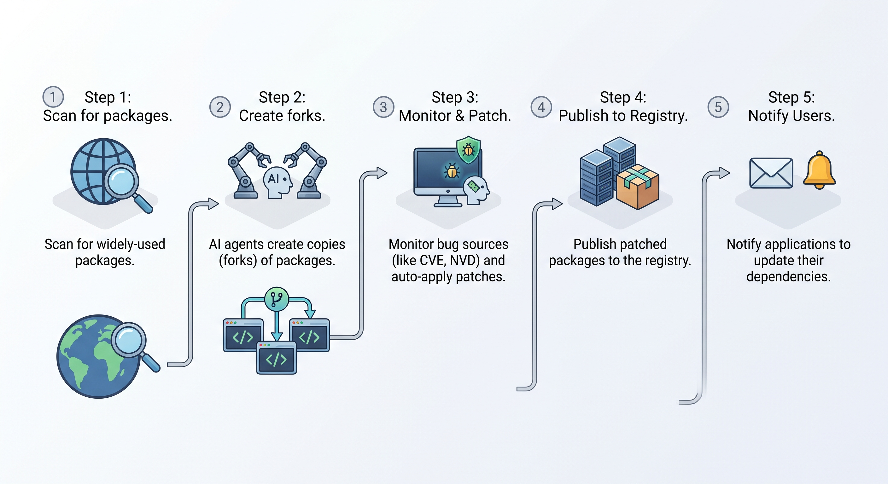

**POSSUM** (Parallel Open Source Software Universe Maintainer) is a proposal to fork the most important open source packages that the world's economy runs on, maintain them with agents, and serve them through a drop-in registry mirror. When a critical vulnerability lands, a patched package should exist in hours, not whenever an unpaid volunteer gets to it. This post covers how we would pick which packages to fork, what an agent is allowed to ship on its own, and why this has to be a public commons rather than another security product.

<!--truncate-->

## The registries never got a distro layer

Daniel Stenberg has maintained curl for nearly three decades. Before AI, the project received [roughly one security report per week](https://cybernews.com/security/curl-bug-bounty-ai-security-reports-daniel-stenberg/). In 2025 that became one every 48 hours. By June 2026 it was one every 18 hours, and unlike the slop wave of early 2025, most of them are now technically accurate. As Stenberg describes, it is cheap to run a scan and turn up thousands of issues, and complicated to get an engineering team to work through them. His warning to the rest of us is that everyone will have to upgrade faster, release faster, and patch more.

That work currently lands on volunteers. [Census III](https://www.linuxfoundation.org/research/census-iii), the Linux Foundation and Harvard study of what companies actually depend on, found that many of the most widely deployed libraries are maintained by only a handful of contributors.

Other ecosystems have solved this before in a different context. Most Linux distributions, like Debian or Red Hat, run a downstream maintenance layer: people who carry patches, backport the minimal security fix into the exact version they shipped, and publish on their own schedule. Debian's [security FAQ](https://www.debian.org/security/faq) has a dedicated entry for users who look at their version number and think they are still vulnerable, because the fix went in without the version bump.

In contrast, npm, PyPI, and crates.io never got that layer. Code goes from the author's laptop to your production build with nobody in between. No downstream maintainer, security team, or backport policy protects users, leading to countless security incidents with massive reach. Traditionally, a distro layer required paid humans reading diffs, which would be difficult to scale to package registries of millions of packages. **Agents change the calculus.**

## How POSSUM works

POSSUM automatically maintains a fork of the most important packages, leveraging AI agents to perform maintenance. We aim to achieve the following goals:

- **Scale**:
  Our target is to be able to automatically maintain the top 100K to 1M packages with minimal human intervention, empowering a small team of [agent-powered maintainers](/posts/open-source-in-the-ai-age).
  We estimate that at this scale, we would cover 99.9% of weekly package downloads on npm.
- **Low end-to-end latency**:
  The time from a new CVE being discovered to a patched package distributed on the registry should be as short as possible, ideally from minutes to hours, not days to weeks.
- **Low operationing costs**:
  Processes should be automated as much as possible, requiring minimal human oversight. We should evaluate ROI in terms of true costs across human time and LLM tokens spent.
- **Simple to use**:
  Users that want to benefit from POSSUM-managed packages should be able with minimal refactoring work.

### POSSUM publishing



1. We scan the Internet for the top package versions used by the most important applications.
   (See the section on [Bunny](#bunny-ranking-packages-by-the-economy-they-carry)).
2. POSSUM agents fork these packages into agent-driven repositories.
3. We monitor sources of bug reports (e.g. [NVD](https://nvd.nist.gov/), [CVE](https://www.cve.org/), [GitHub](https://github.com/advisories)) and automatically generate backport patches for the most widely used major/minor package versions.
4. These patched versions are automatically published to the POSSUM package registry.
5. When possible, we send out automated notices to affected applications to update their dependencies.
6. When possible, we upstream fixes to the original repository for review.

While the mandate today is security backports, we may explore more duties involved in general maintenance in the future, from issue triage, re-packaging for distribution to other ecosystems, and broader feature development.

### POSSUM usage

Anyone can consume POSSUM-maintained packages by configuring their package manager
to use the new registry.

```
npm config set registry https://registry.possum...
```

The one line change masks a number of benefits your application receives:

1. **Transitive dependencies** are covered in your software supply chain, resolving issues even if you did not directly import the package yourself.
2. **Packages are mirrored**, so users automatically receive the same upgrades as the original registry.
3. **Reproducible fixes**: every POSSUM build is reproducible and the diff against upstream is published before the package is installable. Builds are tagged so you always know what you are running (`4.17.21+possum.1`).

In summary, patched versions arrive on an opt-in channel with staged rollout. We make rollbacks simple and you can always pin to the upstream version.

## What an agent is allowed to ship by itself

A wrong fix at machine speed can be worse than a right fix on a delayed timeline. Modern agents are good at finding flaws, but not necessarily good at judging severity or the quality of a patch.

POSSUM aims to narrow the amount of judgement left to the agent. Security backports are a form of software task with a machine-checkable definition of done, because a vulnerability often comes with clear reproduction steps. We build confidence in agent-supplied patches by doing the following:

1. The agent produces a failing test that reproduces the vulnerability against the unpatched package. If we cannot programmatically reproduce the bug, we fail-stop any autonomous deployment and it goes to a human queue for review.
2. Agents autonomously produce patches that makes that test pass, and ensures the full upstream test suite stays green.
3. If these steps succeed, agents can ship to the POSSUM registry automatically without being gated on human review.

When any of the earlier steps fail, we rely on humans to guide the agent towards a fix. When possible, we'll work with the original maintainers to ship suitable outcomes. As a fork on a separate registry, we bias for correctness first, velocity second, and taste third. We expect to regularly deprecate any versions where the upstream fork has pushed a fix.

POSSUM is autonomous for vulnerabilities that come with reproducers and human-gated for everything else. By focusing on a smaller surface than "fully autonomous", we hope to make an actionable improvement over the status quo.

## Bunny: ranking packages by the economy they carry

Rather than fork the entire universe of open source, we want to focus on the packages that matter.
Download counts are the usual proxy, but they are a noisy signal due to CI runs, mirrors, and bots. Census III is the most careful attempt so far, built on 12 million observations of libraries running in production at more than ten thousand companies, and its authors say directly that the report cannot claim which packages are most critical, only which are most widely used.

**Bunny**, a project we are building at [OSO](https://www.oso.xyz/), comes at the gap from the other end. It scrapes the web for JavaScript bundles, decompiles them, and extracts which packages are present in code that is actually shipped to users. Once you can attribute a package to the products running it, you can attribute it to the businesses behind those products, and rank by their market cap or annual revenue.

We aim to answer a different question than how many machines downloaded a package; it asks how much of the economy would notice if it broke. POSSUM's selection function focuses on forking where economic value is high and maintenance capacity is low. Our measurement study is ongoing and an academic paper is in progress.

## Related work

[Chainguard Libraries](https://www.chainguard.dev/libraries) rebuilds packages from source, backports critical and high severity CVE fixes, tests every remediation, and ships signed provenance and SBOMs. [Google's Assured OSS](https://cloud.google.com/blog/products/identity-security/google-cloud-assured-open-source-software-service-now-ga) is a free service, covering more than a thousand Java and Python packages, and pointedly does not fork: it keeps packages current and sends fixes upstream. [HeroDevs](https://www.herodevs.com/) sells drop-in patched replacements for end-of-life packages on an SLA.

These commercial offerings point to a strong market demand for secure alternatives.
POSSUM aims to distinguish itself in 4 ways:

1. POSSUM is operated by the Public Goods Foundation (PGF), a registered 501(c)6 non-profit.
2. We aim to make our work as widely accessible as possible to secure software at scale. Hobbyists, students, and small startups can use our registry for free. The PGF membership models asks those with the most resources and the most to lose, pay to keep the commons sustainable for everyone.
3. POSSUM chooses its target list by aiming to secure the largest economic surface it can with limited budget, rather than by enterprise demand. [Chainguard](https://edu.chainguard.dev/chainguard/libraries/cve-remediation/) and [Assured OSS](https://cloud.google.com/security/products/assured-open-source-software) currently limits backports to Java and Python.
4. POSSUM tries to automate the process of creating backport patches end-to-end with agents. As far as we are aware, no other effort has shipped similar functionality yet. We hope to scale to millions of packages in the future, rather than the single digit thousands from alternatives today.

## Who owns this and who gets paid

POSSUM will be owned and operated by the Public Goods Foundation, a 501(c)6 non-profit.
Our mission is to expand and improve the sustainability of public goods, such as open source software.
We plan to make POSSUM freely available without warranty to anyone under $1M in annual revenue,
covering the vast majority of individual users.
Companies over $1M in annual revenue will need to join as a member of the nonprofit
and pay dues proportional to the firm size in order to use the POSSUM registry.
Members also enjoy a range of other benefits from governance rights to training and support.
Depending on the success of the Foundation, we hope to bring financial sustainability
to a broader cross-section of the open source ecosystem, potentially by
funding underfunded projects or directly hiring individual maintainers.

## Open challenges

There remain a number of open questions that we hope to solve with the community in future designs.

- **Rogue agents**: There are a number of ways that agents can act maliciously, such as from prompt injection or embedded sleeper agent behavior. Automating package distribution expands their reach. How can we ensure that agents fix issues as intended without introducing other vulnerabilities?
- **Supply Chain Provenance**: Even if agents were producing code as intended, many recent supply chain attacks impacted the build and distribution channels. How can we take advantage of existing trusted infrastructure to ensure reliable delivery of secure code to end users?
- **Liability**: Open source software historically involved no liability or warranty. How should we address the systemic failures that come from vulnerabilities in the open source foundation?
- **Trust bootstrapping.** Debian earned its position over thirty years with well-known humans. A new foundation shipping agent-authored builds starts at zero. What earns the first thousand users?
- **The human queue.** The reproducer gate leaves the most subtle vulnerabilities to people. Who staffs that queue, and does it scale with the rest?
- **Divergence.** Every carried patch widens the gap from upstream. Linux distributions usually suffer from a painful lag in release time. What is the merge and retirement policy?
- **Other ecosystems.** We focus on npm and JavaScript due to its wide prevalence in the digital economy. How well will our mechanisms scale to PyPI, Maven, crates.io, and other ecosystems?
- **We become the target.** A widely adopted mirror is the highest value target in the supply chain. Key management and build integrity are existential.
- **Upstream could disagree.** What happens when a maintainer asks us to stop?

## We need your help

Linux got a maintenance layer because a generation of people decided to do the unglamorous work of carrying patches for software they did not write. The registries deserve the same thing. We think agents finally make it scalable. While we are in the proposal stage, we are looking to solve these open challenges and de-risk before the architecture gets put in place. Dependency management systems are notoriously difficult to refactor.

Three ways you can help:

1. If you maintain something in the critical set and have feedback on how it should work,
2. If you are a funder and open to supporting our work,
3. If you are a builder and want to make this a reality,

For each of these, find me in the [group chat](https://t.me/prosperous_software).
